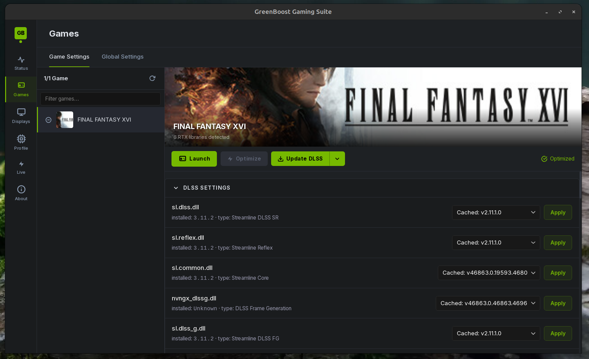

# GreenBoost Changelog

## v3.3 : 2026-08-02

GreenBoost's reference coding model changed to
[`Qwen3.6-27B-Fable-Fusion`](https://huggingface.co/DavidAU) (a dense 27B
model, replacing the older 35B mixture-of-experts one). 

### 💬 The `greenboost-cli` terminal assistant got a cleanup pass

- The chat window used to flash raw internal text (things like
  `<tool_call><function=...>`) whenever the model decided to use a tool ,
  now that's filtered out live, so you only ever see the clean "running
  tool…" card.
- Tools provided by connected MCP servers (used for things like searching
  project memory) sometimes came back as `Unknown instrument` even though
  they were perfectly available , a naming mismatch, now fixed.
- The little memory readout in the bottom-right corner (GPU VRAM / system
  RAM / disk usage) was showing wrong numbers, mostly stuck at zero , it's
  now pulled from GreenBoost's own live monitoring feed, and it visibly dims
  instead of silently freezing if that feed goes stale.
- Fixed a cosmetic glitch where the animated "thinking…" line could leave a
  stray character or two behind on screen.
- `ctrl+o` ("expand the full result") now actually does something , the
  hint had been on screen for a while promising this with no button behind
  it.
- The permission-approval popup box now closes cleanly on the right side
  instead of trailing off mid-line.

### 🗜️ Serving engine, consolidated

- The vLLM backend has been retired. GreenBoost's own built-in engine
  (previously an alternate path) is now the only one used for this class of
  model , one engine to maintain instead of two, and nothing changes for
  anyone already using it.
- The built-in model server's default network port moved from 11434 (which
  collided with Ollama, if you also run that) to 11435, so both can run
  side by side without a fight.

### 🧭 GB-Semantics , one governed answer, not a guess

A new subsystem, GB-Semantics, gives GreenBoost's own AI assistants (and any
MCP client) ONE correct answer per question about GreenBoost's current state,
things like "why is it slow", or "is the quality floor met", 
the same way a data team builds a semantic layer so an analytics
AI stops guessing which table means "revenue". Several internal signals in
GreenBoost mean two different things depending on where they're read from (a
shim-inflated "how full does VRAM *look*" number vs. the real physical one;
a pressure reading that's sometimes a 0/1/2 severity level and sometimes a
0.0-1.0 fraction under the same name), GB-Semantics defines each concept
once, resolves it deterministically, and explicitly flags the field an
assistant should NOT read instead. Reachable over MCP
(`semantic_resolve`/`semantic_answer`/`semantic_segments`/`semantic_metrics`
on `greenboost-orchestrator`) and via a plain `gb_semantics.py` CLI for
anything without MCP. 

### ⚡ GreenBoost now measures the conversation cache instead of guessing its size

The formula for estimating how much GPU memory a model's conversation cache
needs was running about 2.9x too generous for this release's hybrid
architecture, so GreenBoost was reserving nearly three times the memory it
actually needed and leaving that much less for everything else. Rather than
chase the formula through this architecture's internal memory layout,
GreenBoost now measures the real, shim-observed figure from one server run
and reuses it on the next, keyed to the exact model, context size, and cache
precision (`/var/lib/greenboost/synapse/kv_measurements.json`).


### 🧹 `greenboost clear memory-pool` stopped guessing which processes to kill

It used to decide what counted as "leftover AI inference" by matching process
names against a list of known patterns, an approach that's always one unusual
process name away from either missing something or killing something it
shouldn't. It now reads GB-Dataflux's own record of what GreenBoost actually
started, and only reclaims what's genuinely idle and unprotected.


### 🐛 Installer & stability fixes

- Fixed an installer bug where a few third-party libraries (used for model
  compression) could silently fail to copy into place on a machine that
  didn't already have the destination folder , an easy way to end up with
  a working install that was quietly missing a feature.
- Fixed a real regression from this same release's own port change above:
  the terminal assistant's list of known backends still pointed at the OLD
  port, so on any unrelated failure it silently tried talking to a service
  that was never running and reported a confusing, unrelated error instead
  of the real one.
- Fixed the installed `gb` command ignoring an explicit override of where
  it should look for GreenBoost's own files , useful when testing a
  development build instead of the installed one, previously had no effect
  at all.
- A couple of crash-prevention fixes for loading models on GPUs with a
  tighter memory budget.


<details>
<summary><strong>Jump to a version</strong></summary>

- [v3.3 , 2026-08-02](#v33--2026-08-02)
- [v3.2 , 2026-07-12](#v32--2026-07-12)
- [v3.1 , 2026-06-16](#v31--2026-06-16)
- [v3.0 , 2026-06-13](#v30--2026-06-13)
- [v2.9 , 2026-06-10](#v29--2026-06-10)
- [v2.8 , 2026-04-10](#v28--2026-04-10)
- [v2.7 , 2026-03-29](#v27--2026-03-29-same-day-version-update-develop-branch-merged)
- [v2.6 , 2026-03-29](#v26--2026-03-29)
- [v2.5 , first open-source release](#v25--first-open-source-release)
- [v2.4 , last private release](#v24--last-private-release)

</details>

---

## v3.2 : 2026-07-12

### Polished through real use, not just benchmarks

Almost everything released came out of running GreenBoost on
my own machines, mostly local image and video generation through Hugging Face
diffusion pipelines, plus local LLMs, and fixing whatever actually got in the
way. That matters because it's a different kind of testing than writing a
feature and moving on.

### The six subsystems

GreenBoost is organised as six named subsystems, and from v3.2 the docs, the
telemetry and the MCP servers all use the same names:

| Subsystem | What it does in v3.2 |
|---|---|
| 📦 **GB-Tiering** | Extends GPU memory with system RAM (T2) and NVMe (T3). Access frequency, not allocation order, decides what stays in VRAM: the KV cache is reserved in T1 first, weights fill what's left. |
| 🗜️ **GB-Quant** | Compresses **weights** (quantize-to-fit planner, bf16 > int8 > int4, GemLite kernels) **and the KV cache** (TurboQuant, the KV branch , it is *not* a separate product). |
| 📡 **GB-Dataflux** | The flight recorder. Every placement, quantization, tier move, serve and measured tok/s lands in one event log, queryable live over MCP and in a web UI (`greenboost dataflux-ui`). |
| 🌐 **GB-Cluster** | Borrows idle GPUs and RAM from LAN machines ("feeders"), and now peers their *compute*, not just their memory. |
| 🔗 **GB-Synapse** | GreenBoost's own model server + Ollama/OpenAI proxy on `:11435`, in front of `llama-server --rpc`. A drop-in replacement for Ollama that can split one model across two machines' GPUs. |
| 🖥️ **GB-CLI** | The agentic terminal client, **installed by Full Install , no separate setup**. `gb` for the REPL, `gb -p "…"` for one-shot prompts, `gb rag-search …` for headless JSON. It always talks to GB-Synapse on `:11435`, so whatever the cluster is serving is what the agent thinks with. |

### 🖥️ GB-CLI , the agent that ships with GreenBoost

New in v3.2 and previously missing from these notes entirely. Full Install
deploys it into `/usr/local/lib/greenboost/cli-venv` and puts `gb` and
`greenboost-cli` on your PATH. It is **gb-synapse-only** by design: there is no
cloud fallback and no separate ollama path, so every token it generates goes
through the GreenBoost stack (cluster split, gb-quant, tiering) and every turn's
throughput is recorded to GB-Dataflux (`tok_s_measured`). The `greenboost` MCP
server exposes its RAG / goals / factory surface to other assistants, and
`greenboost-synapse` exposes a bridge (`cli_run`, `cli_prompt`) so an LLM can
drive it.

Reliability work this release (all found by running it, not by reading it):

- **Zombie processes were reported as healthy servers.** `_pid_alive()` used a
  signal-0 check, which *succeeds* against a zombie , and a crashed engine stays
  a zombie for as long as the CLI that spawned it lives. So gb-synapse "reused"
  dead servers, `status` lied, and the proxy relayed to a corpse until the user
  saw a truncated stream. Liveness is now read from the real process state.
- **`serve()` never checked readiness.** It returned a server handle the moment
  the process was *spawned*, so the CLI printed `✓ gb-synapse started (pid N)`
  for an engine that was already exiting. It now waits on `/health` (reading the
  body , this llama.cpp answers `200 {"status":"loading model"}`, not `503`) and
  **raises with the engine's own error** instead. No proxy is started in front of
  a dead engine.
- **Mid-stream disconnects surfaced as `RemoteProtocolError` tracebacks.** The
  CLI now asks gb-synapse what actually happened and prints that.

### 🔗 GB-Synapse , now an orchestrator, not just a launcher

The name is the promise: synapse is the *bridge* between a model and GreenBoost,
and its job is to make that model run as well as this cluster can run it. v3.2
teaches it to read what a model actually *is* and place it accordingly:

- **MoE-aware placement.** For a mixture-of-experts model that doesn't fit VRAM,
  the naive fix is to leave whole layers off the GPU , but a dropped layer takes
  its *attention* with it, and attention is read for every token. Measured on
  Qwen3.6-35B: **experts are 18.6 of 20.2 GiB (92%) yet only 8 of 256 fire per
  token**. So gb-synapse keeps every layer's attention and KV on the GPU
  (`-ngl 999`) and offloads only the **expert tensors** (`--n-cpu-moe N`), sized
  from the GGUF's real tensor table.
- **MTP speculative decoding** (`--spec-type draft-mtp`), detected from the
  GGUF's tensors rather than its filename. The draft head is the model's own
  grafted layer, so it costs no VRAM, and the trunk verifies every drafted token
  , the output distribution is unchanged. Upstream measures +34% decode.
- **Vision** (`--mmproj`). Without it a VLM is served text-only and images are
  *silently dropped* , the model then describes a picture it never received.
  Note that Ollama's own blobs carry **no separate projector layer**, so
  vision/OCR models must come from HuggingFace as GGUF + mmproj.
- **KV cache as a quality tier**, not a memory knob: `f16` (certification grade)
  whenever it fits, `q8_0` (budget grade) only to make a context reachable , and
  labelled as such in telemetry. It used to be hardcoded to `q8_0`, quietly
  demoting every model.
- **Context** now defaults to the model's own certified length, clamped to what
  the KV budget can actually hold (it was hardcoded to 64K, discarding 94% of a
  1M-token bake).
- **Cluster fixes:** the feeder's `rpc-server` needed its own engine dir on
  `LD_LIBRARY_PATH` (it died instantly with `libggml.so.0: cannot open shared
  object file`), takes a device *name* (`CUDA0`, not `0`), and is now verified
  **reachable from the host** before it is allowed into `--rpc`/`--tensor-split`
  , an unreachable feeder used to be handed a share of the model anyway, which
  fails the load outright.
- **Ollama `images` are now translated** to OpenAI `image_url` parts by the
  proxy, which is what lets an Ollama-API vision client (ai-forge's critic) work
  through gb-synapse at all.

### 🧪 gb-aviary , 1M context, certified rather than claimed

New module (`gb_aviary.py`), adapted from the aviary-1m harness (MIT):

- **`bake_yarn()`** writes YaRN rope-scaling metadata into a GGUF , 1M context,
  no weight changes. It **derives the smallest factor that reaches the target**
  rather than accepting one, because the factor itself costs quality: the same
  model at the same 1M rung scores 10/10 baked at factor 6 and 9/10 at factor 8.
- **`niah_certify()`** plants needles at spread depths and scores retrieval
  against the *serving* stack, so a model is certified on the same cluster that
  runs it. The KV tier is recorded with the score, because a retrieval number
  without it is a claim, not a certificate.
- **`smoke_gate()`** catches repetition-collapse, the failure signature of a
  quant pushed too far. This is what makes the "never below fp8" rule
  enforceable against **evidence** instead of a table of bit-widths.

All three emit dataflux events (`yarn_bake`, `niah_cert`, `smoke_gate`) ,
including the failures.

### `greenboost cluster` , proud to call this one done, not experimental

Until now, `greenboost cluster` was labeled alpha. v3.2 is the first release
where I'd call it genuinely working, and it's the headline of this release for
a reason: **it brings local AI inference to the next level, because now you can
orchestrate the hardware you already own on your own network instead of it
sitting idle.:

- **Memory aggregation is solid.** A feeder machine's GPU memory, system RAM,
  and disk all fold into the *same* single virtual GPU that Ollama or any CUDA
  app sees. Run `greenboost connect <feeder-ip>` once and that machine simply
  becomes more room to load bigger models into. This tier ordering (local GPU
  memory, then feeder GPU memory, then local system RAM, then feeder system
  RAM, then local disk, then feeder disk) has now been stress-tested moving
  multi-gigabyte weight sets back and forth over the network without
  corruption, including automatic reconnection when a network link hiccups.

- **A Python API that already makes image and video generation faster by
  putting a second GPU to work.** `gb_cluster.py` lets any pipeline hand an
  entire stage (say, prompt encoding) or the tail end of a model off to a
  feeder machine's GPU, then get the result back over a secured connection. On
  a real diffusion pipeline I run at home, combining this with a few other
  fixes took a generation that used to take about 5.5 minutes down to about 42
  seconds, roughly **7.8× faster**, by putting two consumer GPUs to work
  together instead of waiting on one.

**What this means in plain terms:** if you've got a gaming PC and a laptop
with a GPU gathering dust, GreenBoost can now turn that idle laptop into a
second brain for your local inference, instead of it just collecting dust in
a corner.

### dataflux , a flight recorder for everything GreenBoost is doing

This is new in v3.2. GreenBoost now keeps a continuous, low-overhead log of
what the whole system is doing, not just a snapshot when something breaks:
VRAM used and free, GPU and CPU load, temperature and power draw, how full
the KV cache is, when data moves between memory tiers, every quantization
decision, per-machine throughput when a feeder is connected, and even the
real, measured tokens-per-second the model actually delivered. Think of it
like an aircraft's flight recorder: it's always running quietly in the
background, so when you want to know "what was actually happening five
minutes ago," the answer is already there instead of gone.

To look at it, run:

```bash
greenboost dataflux-ui
# or: python3 gb_dataflux.py serve
```

That opens a small local web page (`http://127.0.0.1:8799` by default) that
auto-refreshes every 5 seconds, with sections for quantization decisions,
memory-tier movement, live VRAM/GPU/CPU charts, and, once a feeder is
connected, per-machine cluster throughput:


It works standalone on a single machine, no feeder required, and there's also
a plain-text `greenboost dataflux-ui --llm` / `summary` mode for a quick
snapshot without opening a browser.

### The dataflux MCP server 

`gb_dataflux_mcp.py` is GreenBoost's own MCP server: a read-only window into
the dataflux log above for any MCP-compatible AI assistant, so it can answer
"what actually happened" without you opening the web UI or shelling out. It
shipped in v3.2 with three tools; this cycle it grew to cover the log's full
shape instead of just the top-level summary:

- `dataflux_events` now filters by event **kind**, not just node/label/
  status , the log holds several distinct kinds of activity (tier moves,
  quantization decisions, measured tok/s, cluster job chunks, model pushes)
  and there was previously no way to ask for just one.
- `dataflux_kinds` (new) , a quick breakdown of how many events of each kind
  were logged and when the most recent one happened, so you can see what
  actually happened before drilling into any one thing.
- `dataflux_tier_moves` (new) , just the memory-tier promote/demote/evict
  events from `gb_model_tier.py`.
- `dataflux_quantization` (new) , just the quantization decisions from
  `gb_quant.py`, component and bits chosen, budget vs. actual GiB.
- `dataflux_tok_s` (new) , measured, real tokens-per-second per model, the
  actual client-observed number every orchestration decision is judged
  against, not the predicted one.

Still read-only, still local, still the same JSONL log that backs
`greenboost dataflux-ui`.


### gb-synapse , GreenBoost's own model server, spread across the cluster

** enters this release at beta stage

Also new in v3.2. Ollama is great, but it only serves models from its own
registry. `gb-synapse` (`gb_synapse.py`) goes straight to the source: it
pulls GGUF models directly from any HuggingFace repository, gated or public,
given a token, and it also indexes whatever GGUFs Ollama already downloaded,
so one command sees both. 

The part I'm happiest with: gb-synapse doesn't reinvent cluster serving, it
hands the cross-machine split to llama.cpp's own battle-tested RPC backend,
so a model gets split layer-by-layer across every connected machine and only
the small activation tensors cross the network, not the weights. The
GreenBoost shim keeps doing what it already does underneath, on every node,
so each machine's own share of the model can still spill into that machine's
own RAM if it doesn't fit VRAM. In short: llama.cpp's RPC handles the split
*between* machines, GreenBoost handles the tiers *within* each one.

```bash
sudo greenboost synapse login              # store a HuggingFace token
sudo greenboost pull <repo>[:quant]        # download a GGUF
greenboost synapse run <model>             # serve it, cluster-aware, on :11435
```

Once running, it speaks Ollama's API, OpenAI's API, and HuggingFace's TGI API
on the same port, so existing tools don't need to know anything changed.
Full command reference in

[GREENBOOST_COMMANDS.md § gb-synapse](GREENBOOST_COMMANDS.md#-gb-synapse-huggingface-native-cluster-distributed-gguf-serving).


### Reactive orchestration grows from 3 loops into a real control system

v3.1 introduced `gb_orchestrator`, which closed three feedback loops that used
to just log a problem and do nothing about it (an ECC memory error, VRAM
pressure, and reclaiming idle models). v3.2 expands that considerably: it now
also watches for thermal stress, memory-bandwidth stress, and GPU clock
throttling, and adds a predictive KV-cache grower that only acts once six
independent safety checks all agree it's safe to do so. For the root daemon,
there's now an opt-in continuous tuner that reacts to live system pressure by
adjusting the CPU governor, GPU clock and power limits, and kernel memory
settings, and every change it makes can be undone with the new
`greenboost tune-revert`.

None of this touches your system unless you turn it on
(`GB_ORCH_ACTUATE=1`), by default GreenBoost only watches and reports what it
*would* do, visible through `greenboost vitals`. Under the hood, this runs on
a small new reactive-signal library (`gb_reactive.py`, no external
dependencies) and a hardware-topology module (`gb_topology.py`) that reads
your actual CPU/GPU layout instead of guessing at it.

### Telemetry, polished through daily use

`gb_telemetry.py` picked up a round of real-world polish this cycle: it now
tracks PCIe link health (so a GPU stuck in a degraded PCIe slot is visible
instead of silently slower), host-level pressure metrics (CPU, memory, and
disk I/O, read straight from the kernel's own pressure-stall accounting), and
a feeder-aware mode so a connected feeder's GPU health shows up in the same
telemetry stream as your local one. There's also a lighter-weight GPU-metrics
fallback that needs no extra Python packages, and, closing the loop, a new
measured-tokens-per-second signal that ties every orchestration decision back
to the actual speed a model delivered, not just the speed GreenBoost expected.

### Hot/cold residency engine , the kernel evictor is no longer pure LRU

In plain terms: when GreenBoost has to make room in GPU memory, it now tries
to evict the data you're actually using the least, not just the data that
happened to arrive first.

- New `GB_IOCTL_SET_HEAT` ioctl (`greenboost_ioctl.h` cmd 26): the shim's
  `prefetch_worker` thread now pushes a batched snapshot of live
  `access_count` deltas every ~2s. The kernel ORs the delta into a new
  `struct gb_buf.heat` field and halves it every ~2s on the watchdog
  (ARC-style aging).
- Both eviction sweeps now prefer the coldest eligible candidates first
  (heat==0, then heat≤2, then unbounded) before falling back to pure LRU
  order within each tier , same skip-rule semantics (`frozen`,
  `t1_priority`, `session_priority`, `GB_ALLOC_KV_CACHE` exemptions
  unchanged), just better-ordered eviction among already-eligible buffers.
- New kernel debugfs export, `/sys/kernel/debug/greenboost/residency`
  (per-buffer id/tier/size/heat/flags/pid), and two new commands:
  `greenboost top` (live per-buffer residency, sorted hottest-first) and
  `greenboost residency` (aggregate hot/warm/cold byte breakdown + churn).
  A related new command, `greenboost faults`, surfaces tier-migration and
  memory-fault activity for day-to-day debugging.

### eBPF observability layer (`ebpf/gb_trace.bpf.c`)

In plain terms: a zero-overhead kernel tracer that lets `greenboost faults`
show real, live memory-movement activity instead of a periodic sample.

A CO-RE eBPF tracer attaches kprobes to GreenBoost's own tier-migration
functions (`gb_t3_evict_buf`, `gb_t3_promote_buf`, `gb_auto_evict_cold`,
`gb_alloc_buf`, `gb_pin_user_buf` , not `nvidia_uvm`, which sees no faults
under GreenBoost's pinned-DDR design) and emits structured events to a
ringbuf, consumed by `gb_telemetry.py`'s `EbpfProvider` and surfaced in
`greenboost faults`. The kprobe→ringbuf→telemetry pattern is adapted from
**[bpf_uvm](https://github.com/vchuravy/bpf_uvm)** (Valentin Churavy, MIT
license) , repointed from `nvidia_uvm` fault events onto GreenBoost's own
kernel paths, since that is where the actual migration signal lives for
this architecture. See `THIRD_PARTY_NOTICES.md`. Builds only when
`clang`/`bpftool`/`libbpf-dev` are present (`make BPF=1 ebpf`); degrades
gracefully to procfs/shim_stats-only reporting otherwise.

### Two experimental performance layers, reported honestly

- `gb_prefetch.py` , overlaps loading the next transformer layer with
  computing the current one, for models that aren't already placed by
  gb-quant. Worth saying plainly: in my own benchmarking it hasn't beaten
  the no-prefetch baseline on a gb-quant-placed model yet, so treat it as an
  option to try, not a guaranteed win.

- `gb_diffcache.py` , a TeaCache/DeepCache-style cache for diffusion models
  that skips recomputing a step when barely anything changed since the last
  one, with guards so it doesn't go stale when a LoRA changes mid-run.

### Efficiency quick wins

Four default-safe optimizations toward the AI memory OS roadmap, none
changing default behavior:

- **Version-scoped gb-quant autotune cache.** The persisted GemLite Triton
  autotune file is now keyed on GPU **+ CUDA + gemlite version**, so a toolchain
  upgrade never silently reuses stale kernel configs. Opt-out
  `GB_QUANT_NO_AUTOTUNE_CACHE=1`.
- **Transparent zstd for T3 checkpoints.** Models evicted to NVMe compress
  automatically (python-zstandard → `zstd` CLI → plain fallback); legacy plain
  `.pt` still loads; ratio/timing recorded in the dataflux `tier_move` event.
  Opt-out `GB_T3_COMPRESS=0`.
- **Phase-aware T1 workspace reserve** (`GREENBOOST_T1_WORKSPACE_MB`, default
  off). Holds VRAM back during model load so per-step compute workspace stays
  in T1 instead of spilling to T2, released at inference , generalizes the
  validated diffusion trick (denoise steps 37 s → 10 s) into the shim for every
  workload.
- **Opt-in tiered precision** (`GB_QUANT_TIERED_PRECISION=1`). Hot (fitting)
  weights stay at fp8; the cold overflow tail drops to nvfp4 on Blackwell (else
  int4), trading precision for bandwidth only where weights don't fit. fp8
  stays the default; nvfp4/int4 never become the blanket default.

### AI memory OS tranche + polish roundup

- **`gb_monitor.py`** , canonical read-only telemetry/capability client that
  unifies the four separate `shim_stats` parsers and ioctl mirrors that had
  grown independently across the codebase into one shared source of truth.
  Backs the new `greenboost capabilities` command, which prints the
  installed/running shim's feature manifest (also written to
  `/run/greenboost/capabilities.json` at install time and refreshed at
  runtime).
- **`greenboost pilot`** (`gb_pilot.py`) , a read-only "instrument panel" over
  the dataflux log. It turns the trends already being recorded into
  evidence-backed advice that names the exact `gb_control` lever to pull, but
  never actuates anything itself.
- **Dataflux MCP additions** , `gb_dataflux_mcp.py` gained
  `greenboost_status`, `greenboost_capabilities`, and `greenboost_pilot`
  tools, so an MCP-connected AI assistant can query live capability state and
  pilot advice, not just historical events.
- **`gb_synapse_tools.py`** , text-based tool-call injection for GGUF models
  that don't emit native OpenAI-style `tool_calls`, lifted out of
  greenboost-cli into the shared layer so gb-synapse serving benefits too.
- **`gb_llm_server.py`** , a minimal OpenAI-compatible server built on
  `gb_llm.py`; it's the "gbquant" engine fallback gb-synapse uses when vLLM
  isn't installed.
- **`gb_placement.py`** , an fp8-floor cluster-fit planner
  (`GB_PLACEMENT=1`). It prefers placing overflow on a connected cluster feeder
  over silently dropping below fp8 precision, and arbitrates between GGUF
  (llama.cpp RPC tensor-split) and PyTorch (`offload_tail_blocks`) placement
  depending on what the model actually is.
- **`gb_kernel_backends.py`** , a pluggable low-bit GEMM backend selector for
  gb-quant, chosen via `GB_KERNEL_BACKEND` (GemLite default, `scaled_mm` for
  fp8, bf16 passthrough, CUTLASS reserved for future use).
- **`gb_nvml_ctypes.py`** , a pynvml-compatible NVML binding written directly
  over `ctypes`, so GPU telemetry (`gb_telemetry.py`, dataflux) works even in
  environments where `nvidia-ml-py` isn't pip-installed.
- **Fabric zstd compression** , the cluster wire protocol
  (`features/net_fabric.h`) now compresses host-to-device payloads with zstd
  when both ends negotiate it during the handshake (`feature_flags`, protocol
  v3, backward compatible with v2 feeders).
- **Phase-aware KV prefetch stats mode** (`GREENBOOST_KV_PREFETCH`), exposing
  `kv_prefetch_*` counters so KV-cache prefetch behavior is visible in
  telemetry instead of only inferred indirectly.
- **CUTLASS sm_120a NVFP4 scaffold** (`third_party/gb_cutlass`,
  `GB_CUTLASS_ENABLE` gate) , groundwork for a native NVFP4 GEMM kernel on
  Blackwell; not wired into the default kernel-selection path yet.
- **TurboQuant Triton autotune persistence** and
  `turboquant_attention_from_env`, so `gb_attn.py`'s attention compression can
  be configured entirely from environment variables in serving contexts.
- **Proxy-owned tok/s measurement** on the Ollama-surface streaming paths in
  `gb_synapse_api.py`, closing the loop between orchestration decisions and
  real, client-observed throughput for gb-synapse-served models too.

821 tests green (723 baseline + 98).

---

## v3.1 : 2026-06-16
- Telemetry layer stitched directly into the CUDA shim , live ECC/power/PCIe signals now available in-process at 500 ms resolution.
- New unified runtime stack: `gb_supervisor` (one daemon replaces 4 inert systemd units), `gb_orchestrator` (closes 3 reactive feedback loops), `gb_control` (single actuator layer), `gb_nvml`/`gb_reactive`/`gb_vitals_helper` library.
- `vitals`/`cluster` commands now use in-process pynvml instead of nvidia-smi subprocess forks.
- `vmm_override` PLT fix, `greenboost_setup.sh`.
- Bugfixes

---

## v3.0 : 2026-06-13
v3.0 Includes the work not commited on v2.9 + bugfixes due issues reported by other users

## 🤝 A unified runtime for diffusion pipelines

Modern diffusion systems are composed of multiple independent components, typically CLIP, VAE, and UNet or DiT, that must share GPU resources while executing in the correct order.

`gb_diffusion_orch.py` acts as the coordinator for those components, using the singletons created by `gb_init.py` instead of constructing duplicate runtime objects.

This allows multiple diffusion pipelines to be nested or composed together.


## 🔬 Embedded DCGM telemetry (no daemon required)

GPU telemetry is usually provided by a separate background service (`dcgmd`) that has to be installed, configured, and kept running. That works for managed clusters, but it is unnecessary complexity for local workstations and portable deployments.

GreenBoost now embeds the telemetry engine directly into the runtime.

As soon as GreenBoost starts, it can query the GPU without relying on an external daemon, making deployment identical on both bare-metal machines and multi-GPU clusters.

More importantly, the telemetry is designed to catch hardware problems before they become corrupted model outputs.

If the GPU reports an ECC double-bit error,a condition that indicates uncorrectable memory corruption, GreenBoost immediately emits a warning to `stderr` so the workload can be inspected before invalid results propagate through an entire inference or training run.

Single-bit ECC errors are also tracked over time, providing an early indicator of hardware aging instead of waiting for catastrophic failures.

Beyond memory health, the telemetry continuously monitors instantaneous GPU power consumption together with PCIe connectivity, memory status, thermal conditions, and power delivery. These health checks run every 30 seconds and are lightweight enough that they do not interfere with Triton kernel execution.

For critical workloads, applications can also trigger the diagnostic engine manually before starting a long inference or training session.

NVLink bandwidth reporting is included as well. On GPUs that do not support NVLink, such as the RTX 5070, the reported bandwidth is simply zero instead of producing an error.

For multi-GPU deployments, `ClusterTelemetryManager` creates one telemetry instance per device while sharing a single health-check engine across the entire system, reducing duplicated work while preserving per-GPU visibility.


## 🗜️ Compression layer

thanks to https://github.com/dropbox/gemlite , gran part of gb-quant is based on it (not everything)

There is no single quantization method that is optimal for every model, every tensor shape, or every compression level. Greenboost combines three complementary technologies.

**GemLite provides the execution engine.**
GemLite is a collection of highly optimized Triton kernels that know how to perform matrix multiplication directly on quantized weights. Instead of first decompressing weights into bf16 and then computing, GemLite operates on compressed representations, reducing memory traffic. 

**HQQ provides high-quality 4-bit quantization.**
HQQ (Half-Quadratic Quantization) focuses on preserving model accuracy while reducing weights to 4 bits. It computes quantization parameters that minimize reconstruction error, making it an excellent default choice for layers where quality is more important than achieving the smallest possible representation. HQQ consistently provides the best balance between accuracy, compatibility, and performance at 4 bits.

**TurboQuant pushes compression below 4 bits.**
Traditional 4-bit quantizers begin to lose quality rapidly when forced into 3-bit or 2-bit representations. TurboQuant is specifically designed for these ultra-low-bit regimes, using specialized encoding and execution strategies that preserve significantly more information than standard approaches. This makes it the preferred choice when VRAM is extremely limited and maximum compression is required.

### How they work together

GreenBoost combines these technologies into a single runtime pipeline.

1. **The runtime first determines how much VRAM is available.**
2. **Each layer is assigned the highest precision that still allows the complete model to fit in memory.**
3. **GemLite executes the selected quantized kernels regardless of whether the weights came from HQQ or TurboQuant.**

The selection strategy is:

* **bf16:** Use native floating-point weights whenever memory allows.
* **int8:** Reduce memory with minimal quality loss.
* **int4 (HQQ):** Default low-bit format, optimized for quality.
* **TurboQuant 3-bit / 2-bit:** Used only when more aggressive compression is needed.

If a tensor shape is incompatible with TurboQuant (for example, `K % 128 != 0`), GreenBoost automatically falls back to **int4-HQQ**. If the backend cannot process the tensor at all, execution safely falls back to **bf16**.

In other words:

* **HQQ decides *how to represent* high-quality 4-bit weights.**
* **TurboQuant decides *how to represent* extremely compressed 3-bit and 2-bit weights.**
* **GemLite provides the Triton kernels that execute all of those representations efficiently on the GPU.**

By combining the strengths of all three, GreenBoost maximizes model quality while minimizing VRAM usage, instead of forcing a single quantization method onto every workload.

> **Current limitation:** NVFP4 quantization support is already integrated into GreenBoost, but a known upstream Triton compiler issue currently causes compilation failures. Once that issue is resolved in a future Triton release, NVFP4 support will become available without requiring architectural changes.


🐛 **Regression guards and crash fixes**

This release adds several regression tests and runtime improvements that make the project much more resilient across different CUDA versions, compilers, and AI frameworks.

### Preventing old bugs from returning

One issue involved `cudaGetDriverEntryPointByVersion`, which was originally fixed in **v2.9**. The problem wasn't the implementation anymore,it was making sure future compiler optimizations (especially Link Time Optimization, or LTO) didn't accidentally remove or break the hook.

To prevent that, the function is now part of `EXPECTED_HOOKS`, and a new `TestSo12Trampolines` test performs a positive `readelf` check during CI. If a future build silently drops the symbol, the test fails immediately instead of allowing a broken release.

### Making CUDA 13 initialization behave like older versions

Many AI projects,including **llama.cpp**, **ComfyUI**, and **ggml**,call `cudaMemGetInfo()` before ever calling `cudaSetDevice()`. Earlier CUDA versions tolerated this pattern, but CUDA 13 returns `cudaErrorDeviceUninitialized (998)` instead.

Rather than requiring every application to change its code, the shim now adapts automatically.

If `cudaMemGetInfo()` is called too early, it lazily resolves itself and initializes when needed. At the driver level, `cuMemGetInfo_v2()` and `cuDeviceTotalMem_v2()` now detect an invalid CUDA context and safely fall back to the runtime API. `cuDeviceGetAttribute()` also no longer reports an unnecessary error and simply passes the request through transparently.

The result is that applications written for older CUDA behavior continue to run correctly on CUDA 13 without modification.

### Better support for Clang-built kernels

Most NVIDIA kernel modules are built with GCC, but distributions such as **CachyOS** and some **Arch Linux** configurations build their kernels with Clang instead.

Previously this required manual configuration. The Makefile now detects `CONFIG_CC_IS_CLANG=y` automatically and adds `LLVM=1` to the build flags. This also means DKMS rebuilds after kernel updates continue working without any extra user intervention.

### Automatically selecting the newest CUDA installation

Many development machines have multiple CUDA versions installed side by side,for example CUDA 12 and CUDA 13.

Older build scripts could accidentally select the older toolkit, creating confusing version mismatches. The build system now searches `/usr/local/cuda-[0-9]*`, sorts every installation by version number, and automatically chooses the newest one.

The same version-selection logic is implemented consistently in `greenboost_builder.py` and `greenboost_setup.sh`. If the selected build toolkit differs from the CUDA version reported by `nvidia-smi`, the user receives a warning instead of discovering the mismatch later through runtime failures.

## F-ABI1 `cudart` rebind: fixing shim stacking

One of the most significant stability improvements addresses how the CUDA shim interacts with different versions of `libcudart`.

Previously, the shim assumed applications would load the same CUDA runtime version that it expected. In reality, different AI frameworks may map different `libcudart` versions into memory, causing symbol layout mismatches and unpredictable crashes.

The shim now waits until its first CUDA call and dynamically discovers the application's actual `libcudart` by scanning `/proc/self/maps`. Instead of binding to a hardcoded runtime, it rebinds itself to whatever version the application already loaded.

This eliminates crashes caused by mixing CUDA 12 and CUDA 13 runtimes, including divide-by-zero failures observed in PyTorch grid computations.

The constructor also now uses `RTLD_LOCAL`, ensuring the fallback CUDA runtime remains private instead of polluting the global symbol namespace. This prevents duplicate registration hangs that could occur during library initialization.

Finally, symbol resolution no longer relies on `dlsym()`. Instead, the shim walks the target library's own ELF hash tables directly, avoiding the 15-million-call self-recursion loop that previously occurred during `import torch`.

The same redesign also fixes the infinite-recursion hang seen with `cu128`'s `libcudart.so.12`, making mixed-runtime environments substantially more reliable.


---

## v2.9 : 2026-06-10

Lately I've been running GreenBoost every day on my own image generation
pipelines (diffusers). That's where the new stuff comes from.

🧪 **Polish from daily use**
Daily driving it on my diffuser pipelines turned up small glitches and slow
spots. Cleaned them up. Loading and running the big models feels steadier now
and chokes a lot less.


🌐 **greenboost cluster (alpha/beta)**
You can now pool the GPU memory and compute of a few machines together and use
it like one big GPU. Connect a feeder with `sudo greenboost connect <IP>` and
the overflow layers get stored and run on that machine on their own, no setup
needed. Watch it live with `greenboost cluster`. Still under development, alpha/beta
for now.

🗂️ **Lighter install**
Tidied up the installer, recovered good old options. Better detection of
missing packages on Debian, Ubuntu, Fedora and Arch.

🐛 **Stability**
More crash fixes around very large allocations near the edge of capacity, plus
the hardware auto-tuning maths.


🎮 **Gaming moved out**
The gaming side of GreenBoost has been stripped out and moved into its own project,
still in alpha stage at the moment... 
Do not know when I will release Greenboost Gaming Suite.

https://gitlab.com/IsolatedOctopi/greenboost_gaming_suite



---

## v2.8 : 2026-04-10

On Friday, April 3rd, I had a bicycle accident while jumping some hills.
Four stitches on the eyebrow, a fractured clavicle, and two broken ribs.
I really shouldn't be near a keyboard right now.

---

⚖️ **Trademark compliance - project renamed**

This release was made to comply with a trademark notice concerning the use of the NVIDIA wordmark in the project title. The tool has been renamed:

> **GreenBoost : CUDA Memory & Compute Orchestrator for NVIDIA GPUs**

"NVidia" is used here only as a hardware descriptor, not as a brand identifier.
GreenBoost is an independent open-source project and is not affiliated with, endorsed by, or sponsored by NVIDIA Corporation. NVIDIA, CUDA, GeForce, and RTX are trademarks of NVIDIA Corporation.

---

🎮 **GreenBoost now works with games**

Games that would otherwise hit a VRAM wall, triggering texture pop-in, reduced quality presets, or crashes, can now use the extra headroom.


With DLSS Super Resolution preset override:

| Preset | Quality | Best for |
|--------|---------|----------|
| M (Heavier) | Highest quality | RTX 40/50 series |
| L (Balanced) | Good quality/perf balance | Any RTX |
| K (Lighter) | Better performance | RTX 20/30 series |

Example for preset M:
```
DXVK_NVAPI_DRS_NGX_DLSS_SR_OVERRIDE_RENDER_PRESET_SELECTION=render_preset_m %command%
```

With HDR:
```
```


📚 **Added documentation**
documentation.md
greenboost_commands.md

🧹 **Code mantainance + cleanup**
Internal code refactor, dead code paths removed, and general improvements to the
shim and setup scripts.
Updated RedHat based OS installation script.
Added Arch based OS installation script.
Model tuning tools had been moved into a separate project, this in development at the moment...

🐛 **Stability fixes**
- Enhancements on the agnostic hardware dinamyc calculations.
- Fixed a potential crash when requesting very large memory allocations at the edge of available capacity.

---

## v2.7 : 2026-03-29 same-day version update, develop branch merged

🤖 **Heuristic KV cache detection and prioritization**
The CUDA shim identifies and prioritizes KV cache allocations in T1 VRAM
entirely on its own. Two complementary mechanisms:

1. **Phase detector**: temporal state machine (INIT → MODEL_LOAD → INFERENCE → STEADY)
   classifies every overflow alloc as weights, KV cache, or activations. During
   INFERENCE/STEADY, large allocs (≥ 64 MB, down from 256 MB) receive
   `GB_ALLOC_KV_CACHE | GB_ALLOC_T1_PRIORITY` - the kernel auto-freezes them in T2
   LRU and refuses T3 spill.

2. **Adaptive KV reserve**: the shim reserves T1 VRAM headroom for upcoming KV allocs
   while weights are loading. Once KV has been allocated in T1, the reserve collapses
   proportionally - eliminating the previous double-counting bug where `cuMemGetInfo`
   already reflected the KV allocation but the full reserve was still subtracted.

Set `GREENBOOST_KV_RESERVE_MB` or `GREENBOOST_KV_SIZE_THRESHOLD_MB` to tune.

🎛️ **Adjustable RAM usage limit**
You can now change how much system RAM GreenBoost is allowed to use while running
(`GB_IOCTL_SET_POOL_CAP`). Avoids conflicts with VMs, Docker, or other memory-hungry
workloads running alongside inference.

🛠️ **Profiles**
Hardware profile system for persistent configuration across reboots and for cluster
deployments. A profile is auto-generated on first install from detected hardware.
V100 cluster support: 8-GPU NVLink unified T1 pool (128 GB), Lustre T3 storage,
per-node safety reserve. See `profiles/v100_cluster_node.md`.

🏗️ **Native hardware-targeting build**
The kernel module and CUDA shim are now compiled with flags that target the exact CPU
microarchitecture of the machine where GreenBoost is installed:

```
-march=native -mtune=native -O3 -funroll-loops
-flto -fvisibility=hidden -ffunction-sections -fdata-sections
```
AVX2 is detected automatically at build time (`/proc/cpuinfo`) and enabled if present.
Link-time optimization (`-flto`) and dead-code elimination (`--gc-sections --as-needed`)
produce leaner, faster shared libraries. The shim is built with `-fvisibility=hidden` so
only the hooked symbols are exported - nothing internal is exposed to the linker.

This is not a portable binary. It is compiled for the workstation it runs on, maximising
throughput on the host CPU during shim bookkeeping (hash table probes, phase-detector
timestamp comparisons, atomic KV-reserve accounting).

---

## v2.6 : 2026-03-29

🎨 **New Installer**
New installer UI

📊 **Benchmark and status tools**
New benchmark and status tools accesible trough the wizard.
Status;  Show cuda memory pool + system state
Benchmark; Measure T1/T2/T3 bandwidth

🐛 **`cuMemHostGetDevicePointer_v2` - primary context fix (MR !5)**
The CUDA shim was resolving the v1 symbol `cuMemHostGetDevicePointer`, which returns
`CUDA_ERROR_INVALID_CONTEXT (201)` when the application uses the primary context model
(`cuDevicePrimaryCtxRetain`). PyTorch, vLLM, and most modern ML frameworks use primary
contexts by default, so this caused a silent fallback to UVM (Path C), losing the fast
PCIe DMA path entirely. The fix is a single-line change in `gb_shim_init()` resolving
`cuMemHostGetDevicePointer_v2` instead, which handles both explicit and primary contexts
correctly. Paths A and B now work as intended on PyTorch/vLLM.

🐧 **Debian Trixie support + kernel 6.12+ DMA_BUF build patch (MR !4)**
The setup script now detects Debian (including Trixie / testing / unstable) and installs
the correct packages for that distribution: `linux-cpupower` and `linux-perf` in place of
the Ubuntu-specific `cpufrequtils` and `linux-tools-generic`. The build step also
automatically patches `greenboost.c` with `MODULE_IMPORT_NS(DMA_BUF);` if the line is
absent, which is required for the kernel module to compile on Linux 6.12 and above.

🧠 **Contributors**
2 new contributors:

- **Giuseppe Marco Randazzo** ([@gmrandazzo](https://gitlab.com/gmrandazzo)) - Debian Trixie
  support in `greenboost_setup.sh`; package dependency mapping for Debian testing/unstable
  (`linux-cpupower`, `linux-perf` in place of Ubuntu-specific equivalents); kernel 6.12+
  `MODULE_IMPORT_NS(DMA_BUF)` build-time patch.

- **Alexey Masolov** ([@alexeymasolov](https://gitlab.com/alexeymasolov)) - fix for
  `cuMemHostGetDevicePointer_v2` primary context compatibility; ensures Path A/B work
  correctly with PyTorch, vLLM, and all frameworks that use `cuDevicePrimaryCtxRetain`.
  Without this, `CUDA_ERROR_INVALID_CONTEXT (201)` caused silent fallback to UVM (Path C),
  losing ~32 GB/s PCIe DMA performance. Validated on Quadro RTX 5000 with vLLM 0.18.0.

---

## v2.5 : first open-source release
The v2.5 tag on GitLab marks the first public release of GreenBoost.

🛠️ Path B integrated
Now greenboost can work on virtualized enviornments thanks to Jerry Nguyen.

🧭 Installation script gets broader support
Now greenboost can be installed on RedHat based OS thanks to Alan Sill.


🧠 Contributors
First external contributors joined in this version

- **Alan Sill** ([@alansill](https://gitlab.com/alansill)) - contributed
  `greenboost_setup_rocky.sh`, a setup script for Red Hat-based systems (Rocky Linux,
  AlmaLinux, RHEL). The Ubuntu script now delegates automatically to Alan's script when a
  Red Hat-based OS is detected at runtime.

- **Jerry Nguyen** ([@phubao](https://gitlab.com/phubao)) - contributed the
  kernel-module-free overflow path (MR !3): `cuMemHostRegister(DEVICEMAP)` enables
  GreenBoost VRAM extension inside containers, VMs, WSL2, and HPC clusters without requiring
  `greenboost.ko`. Integrated as Path B of the blended shim.

---

## v2.4 : last private release
v2.4 was the last version developed privately before the project was open-sourced.
There were no external contributors at this stage - all work was done by the author alone.
The core cuda memory pool (VRAM + DDR DMA-BUF + NVMe swap), CUDA shim, and Ollama integration
were functional at this point.

---

## <v2.4 : earlier private development
All versions prior to v2.4 were non-public development releases used exclusively on the
author's own workstation (i9-14900KF / RTX 5070 / 64 GB DDR4 / Samsung 990 EVO Plus 4 TB).
