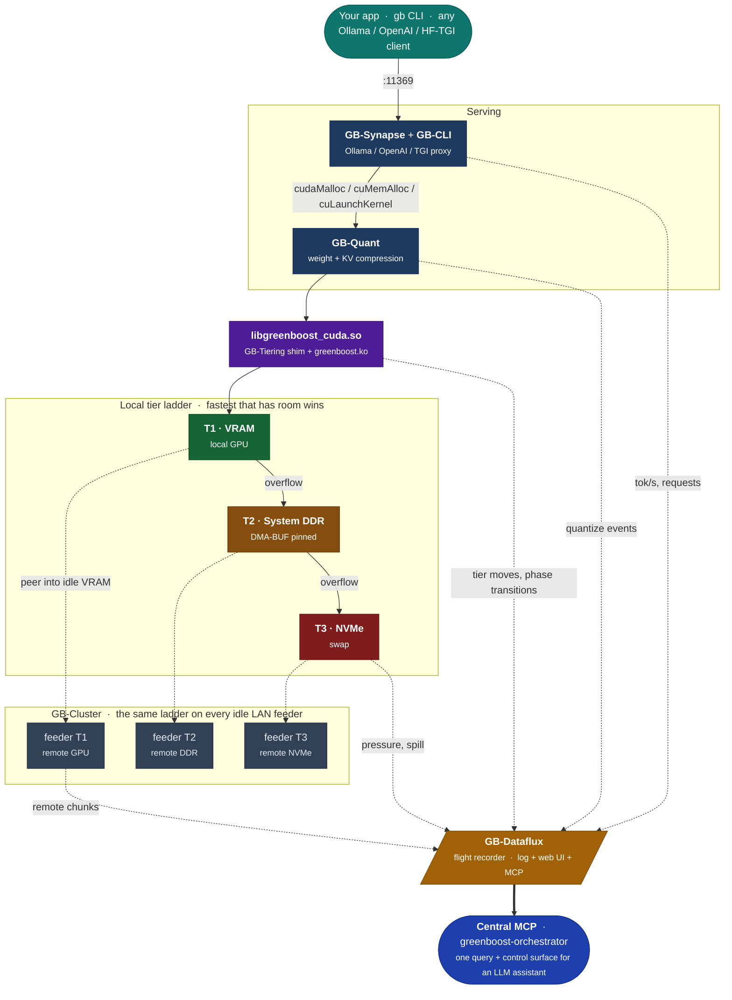

<div align="center">

# ⚡ 🧠 ⚡ GreenBoost ⚡ 🧠 ⚡

### CUDA Memory & Compute Orchestrator for NVIDIA GPUs


## Run bigger models on the GPU you already own.

**Turn GPU VRAM + system RAM + NVMe + idle LAN GPUs into one larger CUDA device.**

No retraining, no code changes. Install it and keep using **Ollama**,
**llama.cpp**, **PyTorch** and **Diffusers** exactly as you do now , or go
straight to **GB-Synapse** and drive the whole stack from **GB-CLI**.

**Status:** daily driver on the author's machine. Every number in this README
was measured on one box , an RTX 5070, 12 GB, PCIe 4.0 x16, 61 GB DDR , against
real workloads. Beyond that box, I genuinely don't know, which is where you
come in.

Looking for the **[GreenBoost Gaming Suite](https://gitlab.com/IsolatedOctopi/greenboost_gaming_suite)** instead?

</div>

<div align="center">

| Subsystem | What it does |
|---|---|
| 📦 **GB-Tiering** | Your GPU's VRAM (T1), system DDR (T2) and NVMe (T3) as one pool. Weights and KV land in the fastest tier with room; only the overflow moves down. Kernel module + CUDA shim. |
| 🗜️ **GB-Quant** | Compresses the two things that fill a card: model weights at load, and the KV cache on every decode step. TurboQuant does the KV branch (PolarQuant + a 1-bit residual), 3-8x less attention bandwidth. |
| 📡 **GB-Dataflux** | The flight recorder. Every placement decision, spill, quantization and throughput sample lands in one event log, queryable over MCP or a live web UI (`greenboost dataflux-ui`). |
| 🌐 **GB-Cluster** | Borrows a GPU sitting idle on your LAN. The remote card's VRAM *and* its compute join the pool , a feeder that only holds bytes is half-wired, and the code says so. |
| 🔗 **GB-Synapse** | GreenBoost's own model server on `:11369`, speaking both the Ollama API (`/api/generate`, `/api/chat`, `/api/tags`) and OpenAI's `/v1/*`. Serves GGUF and HuggingFace models, splits one model across host + feeder GPUs over RPC, and reports real tokens/sec. This replaces Ollama rather than sitting beside it. Loopback-only and unauthenticated by default; set `GB_SYNAPSE_BIND`/`GB_SYNAPSE_TOKEN` before exposing it. |
| 🖥️ **GB-CLI** | The agentic terminal client, installed by Full Install , no separate setup. `gb` or `greenboost-cli` for a session, `gb -p "…"` for one shot, JSON subcommands for scripts. It shows live VRAM/tier/throughput while it works, and can pause a model mid-session to hand the card back. |
| 🧭 **GB-Semantics** | One name per concept, one source per name. Ask "why is inference slow" and get a governed answer instead of a plausible-sounding raw field. Keeps a `never_use` list of the fields that look right and aren't. |

</div>

<div align="center">

**MCP servers** (LLM-facing): `greenboost-orchestrator` (central , full awareness via `greenboost_overview`, `optimize_inference`, `quant_advisor`, `flux_health`, and the GB-Semantics `semantic_*` tools) · `greenboost-dataflux` (event log) · `greenboost-cluster` (live cluster state) · `greenboost-synapse` (serving control + CLI bridge) · `greenboost` (GB-CLI: rag/goals/factory)

</div>


<div align="center">

[Quick Start](#-quick-install) ·
[Documentation](#-documentation-map) ·
[Architecture](#-how-it-works) ·
[GB-Tiering](#-gb-tiering) ·
[GB-Quant](#-gb-quant) ·
[GB-Dataflux](#-gb-dataflux) ·
[GB-Cluster](#-gb-cluster) ·
[GB-Synapse](#-gb-synapse) ·
[GB-CLI](#-gb-cli) ·
[GB-Semantics](#-gb-semantics) ·
[Changelog](CHANGELOG.md)

</div>

---

> **Disclaimer:** GreenBoost is an independent open-source project and is
> not affiliated with, endorsed by, or sponsored by NVIDIA Corporation.
> NVIDIA, CUDA, GeForce, and RTX are trademarks of NVIDIA Corporation.
>
> **Important:** GreenBoost works alongside your existing NVIDIA drivers ,
> it doesn't replace or modify them.

Thanks to all the contributors and the open-source community. GreenBoost
wouldn't exist without them.

---

## What is GreenBoost?

You have a model that is bigger than your graphics card. The usual advice is to
buy a bigger card. GreenBoost is the third option.

It extends CUDA's memory with everything else you already own , system RAM,
NVMe, weight and KV compression, and idle GPUs on your LAN , so a model larger
than your VRAM keeps running. The important part is what *doesn't* move: only
memory crosses PCIe. Every kernel still executes on the GPU.

**This is not CPU offload, and the difference is the whole project.** CPU
offload moves the *work* to your processor, and you pay for it in tokens per
second , heavily. GreenBoost moves the *bytes* and leaves the maths where it
belongs. There is exactly one deliberate exception, MoE expert offload, and it
exists because it measured faster on this hardware, not because something
quietly fell back.

**What you actually get.** It runs daily on this machine against real models,
so here is the honest shape rather than a benchmark. A 15.85 GB model on an
11.9 GB card still streams roughly 4 GB across PCIe every single token, and
that arithmetic lands near 5 tok/s no matter how well everything else is tuned.
GreenBoost makes that model *run*, and tells you plainly why it runs at the
speed it does. It does not make PCIe faster , nothing can, and this board's
root port caps at Gen4 in read-only silicon. Where a model does fit, or where
it is a mixture-of-experts that spreads across the tiers properly, you will see
numbers like 45.72 tok/s.

**If what you want is a longer context**, that is the same problem wearing a
different hat, and GB-Quant is the piece that helps: weights compressed at
load, KV cache compressed on every decode step. On the reference workload a KV
measurement cache took VRAM fill from 67% to 85% and decode from ~3 to 5.3
tok/s, purely by stopping the planner from over-reserving.

Everything runs on hardware you control. No inference, embedding or agent
reasoning is sent to a cloud endpoint , that is a rule enforced in the
codebase, not an aspiration.

---

### Who is this for?

Anyone running a local model on a card one size too small.

- **Newcomers to local LLMs.** You have a 12 or 16 GB card and want a 30B+
  model. Install GreenBoost, let **GB-Synapse** serve it (GGUF or HuggingFace,
  full Ollama-compatible endpoints), and drive it from `greenboost-cli`. Early
  versions of GreenBoost intercepted Ollama; current ones replace it.
- **Inference engineers.** You want context length or batch size past VRAM
  without paying the CPU-offload penalty. Compute stays on the GPU; only bytes
  move.
- **Quality-conscious users.** Your model is 1.5-3x your VRAM. GB-Quant
  compresses both branches to fit it, and `gb_aviary`'s gates measure whether
  quality actually held rather than assuming a bit-width implies it.
- **Anyone with more than one machine.** If you have a second PC, a laptop, or
  an old workstation sitting on the same network, GreenBoost can put its GPU to
  work on the same model. You connect them over your LAN, they become
  "feeders", and the main machine borrows both their spare VRAM *and* their
  compute , so the inference is spread across every card in the house instead
  of being limited to the one in front of you.

---

## ⚡ Quick install

Works on **CUDA 12 and 13** (side-by-side installs are handled automatically)
and on both GCC- and Clang-built kernels (CachyOS, Arch/clang , no manual
`LLVM=1` needed).

```bash
git clone https://gitlab.com/IsolatedOctopi/greenboost.git
cd greenboost
sudo ./greenboost_setup.sh
```

The installer detects your hardware and asks which mode to use:

- **Full Install** - kernel module + system tuning (NVMe scheduler, swap,
  THP, hugepages) + GB-CLI + the MCP servers. Best on a dedicated AI/ML
  workstation.
- **Light Install** - kernel module only. Safer on a daily-driver desktop
  where you don't want sysctls changed.

If you're inside a container, a VM, or WSL2 (no kernel module possible),
GreenBoost auto-falls back to **Path B** (no-kmod mode). See
[CONTAINER_VM_MODE.md](CONTAINER_VM_MODE.md).

---

## 📚 Documentation map

| Document | When to read it |
|---|---|
| [DOCUMENTATION.md](DOCUMENTATION.md) | You want the long-form story , the subsystems, architecture, tiers, cluster, observability, all in one place |
| [greenboost_documentation_extension_official_nvidia.md](greenboost_documentation_extension_official_nvidia.md) | You are integrating GreenBoost into a new framework and need to know exactly where the shim departs from NVIDIA's documented CUDA behaviour (Chapter G, written in the style of the CUDA Programming Guide) |
| [CONTAINER_VM_MODE.md](CONTAINER_VM_MODE.md) | Docker, LXC, KVM, WSL2, HPC, Kubernetes |
| [GREENBOOST_COMMANDS.md](GREENBOOST_COMMANDS.md) | "What does `greenboost cluster` do again?" - full CLI reference |
| [CHANGELOG.md](CHANGELOG.md) | Version history |

---

## 🔧 How it works

GreenBoost is seven subsystems sharing one stack, not just a memory
extender. Requests arrive through **GB-CLI** / **GB-Synapse**, weights and
KV get squeezed by **GB-Quant**, the **GB-Tiering** shim + kernel module
place every byte in the fastest tier that has room, **GB-Cluster** mirrors
that same tier ladder onto any idle LAN machine, **GB-Dataflux** logs every
layer above, and the **Central MCP** (`greenboost-orchestrator`) gives an
LLM assistant one query surface over all of it:



The kernel module (`greenboost.ko`) is the trick behind GB-Tiering: it pins
2 MB hugepages of system RAM and hands them to CUDA via
`cuImportExternalMemory` (zero-copy) or `cuMemHostRegister` (host-mapped).
The GPU's PCIe engine reads tensors straight from DDR; the CPU never touches
the data. GB-Cluster reuses the identical tier ladder over the network, so
a feeder's VRAM/DDR/NVMe are just T1/T2/T3 one hop further away.

**Two big things make this practical:**
1. The shim has a *phase detector* (`INIT → MODEL_LOAD → INFERENCE → STEADY`)
   that learns when KV cache is being allocated and pins it in T1 so
   attention runs at full GPU bandwidth.
2. Computation is **always on the GPU.** GreenBoost moves memory, never
   compute. CPU offload is what other tools do; CPU offload turns a 50
   tok/s setup into a 2 tok/s setup. GreenBoost stays at ~95 % of native
   GPU speed for the parts that fit, and degrades gracefully for the rest.

Jump to a subsystem's own section for the details: [GB-Tiering](#-gb-tiering) ·
[GB-Quant](#-gb-quant) · [GB-Dataflux](#-gb-dataflux) · [GB-Cluster](#-gb-cluster) ·
[GB-Synapse](#-gb-synapse) · [GB-CLI](#-gb-cli).

### Containers, VMs, WSL2: Path B

Some environments don't let you load kernel modules - Docker without
`--privileged`, KVM guests, WSL2, shared HPC nodes. In those, GreenBoost
runs in **Path B** mode: it skips `greenboost.ko` entirely and pins host
memory through `cuMemHostRegister`. Slightly higher per-allocation cost
(no zero-copy import) but otherwise the same behaviour.

Jerry Nguyen contributed this path. See
[CONTAINER_VM_MODE.md](CONTAINER_VM_MODE.md).

---

## 📦 GB-Tiering

**Extend GPU memory using system RAM and NVMe , the T1/T2/T3 tier layer that
every other subsystem allocates through.**

GB-Tiering is the engine behind the diagram above: the LD_PRELOAD shim
(`libgreenboost_cuda.so`) plus the kernel module (`greenboost.ko`) place each
allocation in the fastest tier that still has room, and spill only what
doesn't fit.

| Tier | Backing | Used for |
|---|---|---|
| **T1** | GPU VRAM (real `cudaMalloc`) | KV cache first, then as many weights as fit |
| **T2** | System DDR, DMA-BUF pinned hugepages | Weights that overflow VRAM, read by the GPU over PCIe |
| **T3** | NVMe | Last-resort overflow |

Placement is driven by **access frequency, not allocation order**: the KV
cache is re-read on every decode step, so it is reserved in T1 first and the
weights fill whatever VRAM is left. A single allocation larger than free VRAM
is *split* rather than dumped wholesale into DDR - VRAM is driven toward ~90 %
occupancy, and only the genuine remainder spills.

```bash
greenboost vitals         # live TUI: tiers, VRAM, pressure, phase
greenboost health-check   # one-shot PASS/FAIL/WARN across module/VRAM/T2/T3/cluster
greenboost capabilities   # installed/running shim feature manifest
```

From Python, `gb_tiering.py` is the one import for the tier layer
(`ModelTierManager`, `Tier`, `MemPoolManager`, and `tiering_status()` for live
state); over MCP, `tiering_status` / `greenboost_status` expose the same thing
to an assistant.


GreenBoost way: **compute stays on the GPU, only memory moves.** 
When a kernel needs a weight that lives in DDR, the GPU reads it over PCIe (≈25 GB/s on PCIe 4.0 x16, ≈55 GB/s on PCIe 5.0). 
The CPU is not in the data path.

End-to-end, you get something close to "GPU with 2-4× more VRAM" rather than "GPU + CPU painfully sharing the work." Yet System DDR is slower than GPU VRAM.

GreenBoost applies techniques to avoid CPU spillover always that harms ai inference speed and/or quality. It provdies a direct VRAM <> System RAM + GPU transfer of data, without need for a copy at CPU which only adds more latency. 

New in v3.3: a wrong CUDA attribute constant was silently disabling this
T2 spill path for a class of hybrid-architecture models, degrading straight to
partial CPU offload with no warning. Fixed at the source, and a new refusal
gate now blocks any capacity-driven GPU-layer reduction by default, only
serving degraded under an explicit debugging override.

---

## 🗜️ GB-Quant

**Compress model weights and the KV cache so larger models fit into available
VRAM , the fastest tier is the one you fit in.**

GB-Quant has **two branches**, used alone or together:

- the **weights branch** shrinks the model's weights once, at load
  (`gb_quant.py`, planner + low-bit GEMM kernels);
- the **KV branch , TurboQuant** shrinks the KV cache continuously, on every
  decode step (`gb_attn.py`, and the system-wide `greenboost turboquant`
  toggle).

They solve different bottlenecks, which is why both exist under one subsystem.

### Weights branch , quantize-to-fit

thanks to https://github.com/dropbox/gemlite

Memory overflow gives you *capacity*, not *bandwidth*: a weight living in
system RAM is read at PCIe speed, ~12× slower than VRAM. For models that
are 1.5-3× your VRAM, quantizing is usually the better answer than spilling:
shrink the weights so the whole working set fits T1 VRAM and runs at full
GPU bandwidth.

```python
import gb_quant
report = gb_quant.quantize_to_fit(pipe_or_model, budget_gb=11.0)
```

- **Quality-first planner:** every component gets the *highest* precision
  that still fits the budget (bf16 > int8 > int4). Nothing is quantized
  that didn't need to be.
- **Self-contained:** the low-bit Triton GEMM kernels (Apache-2.0, in
  `third_party/`) and quantizer ship inside GreenBoost - your venv installs
  nothing extra.
- **Works with**: diffusers pipelines (two-phase text-encoder recipe
  included), HF causal LLMs (`gb_synapse_fallback.py`'s `load_causal_lm`/
  `generate`, or natively through gb-synapse's own torch-core engine ,
  bf16/GPTQ/AWQ/FP8), and pipelines you don't own via the
  `GB_QUANT_BUDGET_GB` environment hook.
- Measured on an RTX 5070 12 GB: a 9 B image model that needed ~7 min/image
  through DDR overflow runs at ~5 s/image quantized into VRAM, with no
  visible quality loss; a 12 B LLM (22.7 GiB bf16) fits in 6.2 GiB.
- **Component-sensitivity-aware, not just budget-aware** (`gb_quant_roles.py`,
  `gb_gguf_plan.py`): recurrent/state-tracking tensors (a small minority of
  bytes, but disproportionately sensitive to compression) get protected at a
  quality floor regardless of what a flat per-layer error proxy alone would
  suggest, while the ordinary feed-forward majority takes the aggressive
  compression instead — for GGUF models served through gb-synapse, this
  wires directly into `llama-quantize`'s own per-tensor type override; for
  torch checkpoints, into the same DP planner above. Mechanism is built and
  tested; the live before/after measurement on the reference workload is
  still pending — see `missing_features.md` item (j).

The low-bit GEMM kernel underneath (GemLite, `scaled_mm` fp8, bf16
passthrough) is itself pluggable via `gb_kernel_backends.py` and
`GB_KERNEL_BACKEND`.

### KV branch , TurboQuant

The KV cache is re-read on *every* decode step, so its bandwidth cost
compounds over a whole generation - a different bottleneck than the one-time
weight load. TurboQuant quantizes the K and V tensors as attention runs,
freeing PCIe/VRAM bandwidth for the rest of the model without materially
changing output quality.

System-wide, zero code changes:

```bash
sudo greenboost turboquant on     # Ollama KV cache -> q4_0, GREENBOOST_TURBOQUANT=1
greenboost turboquant status
sudo greenboost turboquant off    # back to q8_0
```

Or fine-grained control from Python (`gb_attn.py`):

```python
from gb_attn import turboquant_attention

# Asymmetric: K keeps more precision (needed for Q·Kᵀ), V needs less
with turboquant_attention(k_bits=4, v_bits=3):
    output = model(input)
```

- **Asymmetric by design:** K tensors get full TurboQuant (PolarQuant +
  a 1-bit QJL residual, preserving inner products for attention scores);
  V tensors get PolarQuant only (MSE-optimal, no inner-product needed).
- **Bandwidth:** 3-8× reduction depending on bit widths; `k_bits=4,
  v_bits=3` gets ~4× with +0.23% PPL - effectively free.
- **Layer-adaptive:** the first two and last two layers automatically get
  +1 bit of K precision, where quality is most sensitive.

GB-Quant and GB-Tiering are complementary: quantize weights to fit first,
compress the KV cache so attention doesn't reopen the bandwidth problem, and
let T2 DDR / T3 NVMe absorb only what genuinely exceeds the quantized
footprint.

---

## 📡 GB-Dataflux

**Live telemetry exposed through the GreenBoost Dataflux MCP server and a web
dashboard , a flight recorder for your inference.**

New in v3.2. GreenBoost continuously logs what your whole setup is doing ,
VRAM used/free, GPU and CPU load, temperature and power, KV-cache pressure,
memory-tier moves, quantization decisions, measured tokens/sec, and (once a
feeder is connected) per-machine cluster throughput , so you can look back at
what actually happened, not just guess from a single snapshot.

```bash
greenboost dataflux-ui        # opens a live web page at :8799
```


It works standalone on a single machine, no feeder required, and auto-refreshes
every 5 seconds. Full reference: [DOCUMENTATION.md § dataflux](DOCUMENTATION.md).

`gb_dataflux_mcp.py` exposes the same log read-only over MCP
(`dataflux_summary`, `dataflux_events`, `dataflux_errors`, `dataflux_tok_s`,
`greenboost_status`/`capabilities`/`pilot`), so any MCP-compatible AI
assistant can query live capability state and dataflux history directly
instead of you opening the web UI. Every other subsystem emits into this one
log, which is what makes a placement or quantization decision traceable after
the fact.

```bash
greenboost pilot          # dataflux-driven advice on what lever to pull next
```

---

## 🌐 GB-Cluster

**Borrow idle GPU and RAM resources from other machines on your local network.**

💻 Got a laptop lying around collecting dust with an idle NVIDIA GPU inside?
Put it to work: start `greenboost cluster` and watch it in `greenboost
dataflux-ui` +  `greenboost dataflux MCP` (direct dataflux connection for your inference pipelines).

Cluster mode has existed since v2.9, but **v3.2 is the first release where
it's genuinely working**, not just alpha-stage.
GB-Cluster brings local AI inference to the next level, because now you can
orchestrate the hardware you already have on your own network, instead of an
idle laptop GPU just sitting there. It's also been polished through real daily
use, mostly Hugging Face diffusion pipelines, not just synthetic benchmarks.

Start a feeder on the idle machine:

```bash
sudo greenboost feed start
```

On your "host" (the one doing inference), each remote machine becomes a
**feeder**:

```bash
sudo greenboost connect 192.168.1.42
greenboost cluster        # interactive TUI showing all feeders + status
```

The shim treats the local VRAM + every feeder's VRAM + every feeder's DDR
+ every feeder's NVMe as **one virtual device** - a model that doesn't fit
on your card can now overflow into a whole second machine, not just your
own RAM.

Where this pays off *today*, measurably: `gb_cluster.py` gives any PyTorch
pipeline a simple API to hand off a whole stage (e.g. text encoding) or the
tail of a model to a feeder's GPU (`offload_tail_blocks`, backed by
`gb_remote_blocks.py` - a persistent, model-agnostic tensor-RPC worker that
holds the tail transformer blocks in feeder VRAM so only activations cross
the wire on every step). On a real diffusion pipeline at home, combining
that with a few related fixes took a generation from ~5.5 minutes down to
~42 seconds - about **7.8× faster**, from putting a second consumer GPU to
work instead of leaving it idle. For GGUF models, `gb_placement.py` picks
between that split and llama.cpp's own RPC tensor-split (GB-Synapse, below)
automatically, always preferring a cluster feeder over silently dropping
below fp8 precision (`GB_PLACEMENT=1`).

Live cluster state is queryable at any moment over the `greenboost-cluster`
MCP server (`cluster_status`, `cluster_snapshot`, `cluster_feeders`), and every
dispatch leaves a GB-Dataflux event, so a feeder is never a black box.

The cluster fabric is secured with:
- Pre-shared key (PSK) auth + HKDF-derived session keys (`feeders genkey`,
  `feeders export-key` / `import-key` to distribute one across machines)
- Per-message MAC (proto v4) to prevent tampering
- LAN-only bind by default; you opt in to WAN explicitly
- AppArmor profiles for the daemon

Full security model: [DOCUMENTATION.md § Cluster security](DOCUMENTATION.md).

---

## 🔗 GB-Synapse

**GreenBoost's own model server and Ollama-compatible proxy on `:11369`,
spread across the cluster.**

Greenboost at first versions was intercepting ollama calls,
on those new latest versions greenboost ships GB-Synapse, 
a proper backend serving GGUF (with full compatible ollama endpoints) + 
hugging face models + 100% integrated / making use of all greenboost features. 

Type "greenboost-cli" on terminal, if you haven't yet,
you can also point your custom scripts to gb-synapse.

is a simple cli to manage those models directly from your terminal. |


```bash
sudo greenboost synapse login              # store a HuggingFace token
sudo greenboost pull <repo>[:quant]        # download a GGUF
greenboost synapse run <model>             # serve it, cluster-aware, on :11369
```

The proxy in front of `llama-server` speaks Ollama's API (`/api/generate`,
`/api/chat`, `/api/tags`, `/api/show`, `/api/ps`), OpenAI's `/v1/*`, and
HuggingFace's TGI API on the same port, so existing tools don't need to know
anything changed - a genuine drop-in replacement for Ollama. It measures
tokens/sec proxy-side and emits it to GB-Dataflux, which closes the loop
between an orchestration decision and its real, client-observed throughput.

Serving control is also exposed over the `greenboost-synapse` MCP server
(`synapse_status`, `synapse_models`, `synapse_ps`, `synapse_recommend`,
`synapse_doctor`; `synapse_serve`/`synapse_stop` are confirmation-gated so an
assistant can't yank a live `:11369` out from under you).

**Security:** the proxy binds `127.0.0.1` with no auth by default — every
local consumer (greenboost-cli, ai-forge) keeps working unchanged. LAN or
container reach (e.g. exposing `:11369` to a sandboxed agent runtime) needs
`GB_SYNAPSE_BIND` + `GB_SYNAPSE_TOKEN` (or `/etc/greenboost/synapse_token`,
0600); a non-loopback bind with no token refuses to start rather than
silently serving unauthenticated. See
[docs/nemoclaw-and-greenboost.md](docs/nemoclaw-and-greenboost.md) for the
worked example (NVIDIA NemoClaw as a client of gb-synapse).

Full reference: [GREENBOOST_COMMANDS.md § gb-synapse](GREENBOOST_COMMANDS.md#-gb-synapse-huggingface-native-cluster-distributed-gguf-serving).

When gb-synapse's own torch-core engine can't take a checkpoint (or its venv
isn't installed), GB-Synapse falls back to `gb_synapse_fallback.py`, a
minimal single-request OpenAI-compatible server (transformers + gb-quant) -
same API surface, no extra dependency.

The torch-core engine's own model zoo also now covers **Mamba-2** -- a
different family of model that replaces regular attention's growing,
per-token memory with a small, fixed-size recurrent state instead. Pull one
straight from HuggingFace the same way as anything else and it serves
through the same `/v1/*` API, cluster telemetry, and shim placement rules as
every other model here:

```bash
sudo greenboost pull <mamba2-repo> --engine torch
greenboost synapse run <model>
```

New in v3.3: the usable conversation window for GB-Synapse's reference model
went from 2,048 tokens to roughly 46,000 on the same card, three separate
context-accounting bugs closed in one cycle (a ~4x KV overestimate for
hybrid attention, a budget that charged for weight bytes never placed on the
GPU, and a client that never actually asked the server how much room it had).
The KV cache reservation itself is now measurement-backed: GreenBoost caches
the real shim-observed size per model/context/precision and reuses it on the
next serve, instead of re-estimating from a formula every time.

---

## 🖥️ GB-CLI

**Agentic terminal client, installed by Full Install , no separate setup.**

```bash
gb or greenboost-cli                        # interactive agent in your terminal
gb -p "summarize this repo"   # one-shot prompt
gb rag-search "kv cache"      # headless JSON subcommand, for scripts
```

GB-CLI always talks to **GB-Synapse on `:11369`**, so whatever you served
(Ollama-indexed or HuggingFace-pulled GGUF, single-GPU or RPC-split across the
cluster) is what the agent runs on, with GB-Quant and GB-Tiering underneath and
every turn's measured tokens/sec landing in GB-Dataflux.

Full Install deploys it into `/usr/local/lib/greenboost/cli-venv` and puts
`gb` + `greenboost-cli` on your PATH; the `greenboost` MCP server exposes its
rag/goals/factory surface to other assistants.


---

## 🧭 GB-Semantics

One name per concept, one source per name.

The problem this solves is specific and it bit repeatedly before the layer
existed. Several raw GreenBoost fields look like the answer and are not: a
shim-inflated "virtual" VRAM figure that reads full while physical VRAM is
nearly empty, and a pressure field that means a 0/1/2 severity level in one
place and a 0.0-1.0 fraction in another , under the identical name. Read the
wrong one and you get a confident, wrong answer.

So metrics go through a resolver instead. Every metric declares its source, its
units, its owner, and a `never_use` list naming the traps with the incident
that proves each one. Segment verdicts are three-valued , `matched`, `clear`,
or **`unknown`** , because a telemetry failure that reads as a clean bill of
health is the exact failure this layer exists to prevent.

```bash
python3 gb_semantics.py answer "is rule 1 satisfied?"
python3 gb_semantics.py resolve vram_fill_pct
```

Over MCP: `semantic_metrics` (discover), `semantic_resolve` (one governed
value + provenance), `semantic_segments` (named canonical filters, e.g.
`rule1_underfilled`, `swap_thrash_not_gpu_throttle`), `semantic_answer` (full
question routing) , all on `greenboost-orchestrator`. Every non-MCP consumer
(GB-CLI, ai-forge) gets a bounded summary card for free via
`gb_monitor.context_summary()`.

`checks/check_semantics_coverage.py` blocks a merge if a metric/segment loses
its resolver, and `tests/test_semantics_evals.py` runs a trap-weighted eval
set against a frozen fixture on every run.

---

## 🙌 Contributors

- **Alan Sill** ([@alansill](https://gitlab.com/alansill)) - setup scripts
  for Red Hat–based systems (Rocky Linux, AlmaLinux, RHEL).
- **Jerry Nguyen** ([@phubao](https://gitlab.com/phubao)) - kernel-
  module-free path for containers and VMs.
- **Giuseppe Marco Randazzo** ([@gmrandazzo](https://gitlab.com/gmrandazzo)) -
  Debian Trixie support and Linux 6.12+ compatibility fixes.
- **Alexey Masolov** ([@alexeymasolov](https://gitlab.com/alexeymasolov)) -
  PyTorch and vLLM compatibility fixes on modern systems.

---

## 🔗 Non direct contributors

- **Mobius Labs** thanks to https://github.com/dropbox/gemlite, big part of gb-quant is based on it

GemLite is a collection of Triton kernels designed for efficient low-bit matrix multiplication, emphasizing simplicity and reusability. It provides a practical solution for achieving significant performance gains, delivering up to 7-8x faster prefill and 3-6x faster decoding compared to default Torch AO kernels.

---

## 💡 Inspirational sources

[THIRD_PARTY_NOTICES.md](THIRD_PARTY_NOTICES.md).


## 📄 License

**GPL v2** - same licensing model as NVIDIA's official open-source
kernel modules (`github.com/NVIDIA/open-gpu-kernel-modules`).

Individual source files are MIT-licensed; when linked together into a
Linux kernel module the resulting binary is dual MIT / GPLv2.  See
`LICENSE` for the full text.

If you fork, modify, or reference this project, please credit Ferran
Duarri.

```
Copyright (C) 2026 Ferran Duarri
```

GreenBoost is an independent open-source project and is not affiliated
with, endorsed by, or sponsored by NVIDIA Corporation. NVIDIA, CUDA,
GeForce, and RTX are trademarks of NVIDIA Corporation.
</content>
</invoke>
