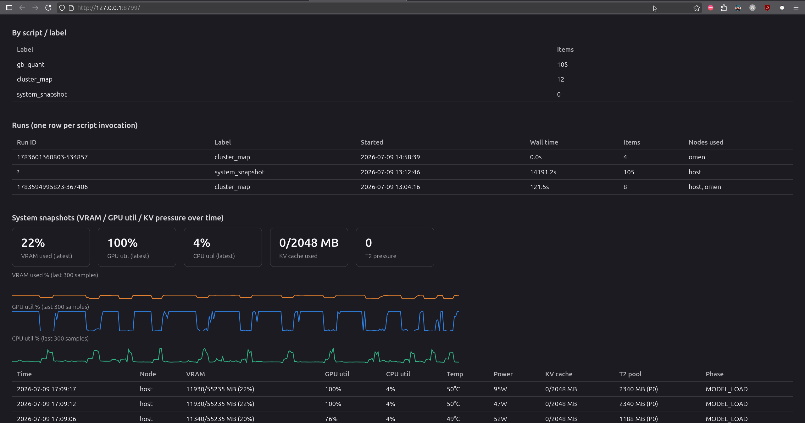

<div align="center">

# ⚡ 🧠 ⚡ GreenBoost ⚡ 🧠 ⚡

### CUDA Memory & Compute Orchestrator for NVIDIA GPUs


## Run bigger models on the GPU you already own.

**Turn GPU VRAM + system RAM + NVMe + idle LAN GPUs into one larger CUDA device.**

No retraining, no code changes. Install it and keep using **Ollama**,
**llama.cpp**, **PyTorch** and **Diffusers** exactly as you do now, or go
straight to **GB-Synapse** and drive the whole stack from **GB-CLI**.

**Status:** daily driver on the author's machine. Every number in this README
was measured on one box, an RTX 5070, 12 GB, PCIe 4.0 x16, 61 GB DDR, against
real workloads. Beyond that box, I genuinely don't know, which is where you
come in.

🎮 Looking for the **[GreenBoost Gaming Suite](https://gitlab.com/IsolatedOctopi/greenboost_gaming_suite)** instead?

🐧 Don’t miss to check **[Hyphaed kernel](https://gitlab.com/IsolatedOctopi/linux-kernel-inference)** ;  
Custom patched linux kernel being used alongside greenboost, includes patches (sent to kernel lists),
yet not included elsewhere as of Aug 21, 00:46.


</div>

<div align="center">

| Subsystem | What it does |
|---|---|
| 📦 **GB-Tiering** | Your GPU's VRAM (T1), system DDR (T2) and NVMe (T3) as one pool. Weights and KV land in the fastest tier with room; only the overflow moves down. Kernel module + CUDA shim. |
| 🗜️ **GB-Quant** | Compresses the two things that fill a card: model weights at load, and the KV cache on every decode step. TurboQuant does the KV branch (PolarQuant + a 1-bit residual), 3-8x less attention bandwidth. |
| 📡 **GB-Dataflux** | The flight recorder. Every placement decision, spill, quantization and throughput sample lands in one event log, queryable over MCP or a live web UI (`greenboost dataflux-ui`). |
| 🌐 **GB-Cluster** | Borrows a GPU sitting idle on your LAN. The remote card's VRAM *and* its compute join the pool, a feeder that only holds bytes is half-wired, and the code says so. |
| 🔗 **GB-Synapse** | GreenBoost's own model server on `:11369`, speaking both the Ollama API (`/api/generate`, `/api/chat`, `/api/tags`) and OpenAI's `/v1/*`. Serves GGUF and HuggingFace models, splits one model across host + feeder GPUs over RPC, and reports real tokens/sec. This replaces Ollama rather than sitting beside it. Loopback-only and unauthenticated by default; set `GB_SYNAPSE_BIND`/`GB_SYNAPSE_TOKEN` before exposing it. |
| 🖥️ **GB-CLI** | The agentic terminal client, installed by Full Install, no separate setup. `gb` or `greenboost-cli` for a session, `gb -p "…"` for one shot, JSON subcommands for scripts. It shows live VRAM/tier/throughput while it works, and can pause a model mid-session to hand the card back. |
| 🧭 **GB-Semantics** | One name per concept, one source per name. Ask "why is inference slow" and get a governed answer instead of a plausible-sounding raw field. Keeps a `never_use` list of the fields that look right and aren't. |

</div>

<div align="center">

**MCP servers** (LLM-facing): `greenboost-orchestrator` (central, full awareness via `greenboost_overview`, `optimize_inference`, `quant_advisor`, `flux_health`, and the GB-Semantics `semantic_*` tools) · `greenboost-dataflux` (event log) · `greenboost-cluster` (live cluster state) · `greenboost-synapse` (serving control + CLI bridge) · `greenboost` (GB-CLI: rag/goals/factory)

</div>


<div align="center">

[Quick Start](#-quick-install) ·
[Feature map](#-feature-map) ·
[Documentation](#-documentation-map) ·
[Architecture](#-how-it-works) ·
[GB-Tiering](#-gb-tiering) ·
[GB-Quant](#-gb-quant) ·
[GB-Dataflux](#-gb-dataflux) ·
[GB-Cluster](#-gb-cluster) ·
[GB-Synapse](#-gb-synapse) ·
[GB-CLI](#-gb-cli) ·
[GB-Semantics](#-gb-semantics) ·
[Kernel](#-the-kernel-underneath) ·
[Changelog](CHANGELOG.md)

</div>

---

> **Disclaimer:** GreenBoost is an independent open-source project and is
> not affiliated with, endorsed by, or sponsored by NVIDIA Corporation.
> NVIDIA, CUDA, GeForce, and RTX are trademarks of NVIDIA Corporation.
>
> **Important:** GreenBoost works alongside your existing NVIDIA drivers,
> it doesn't replace or modify them.

Thanks to all the contributors and the open-source community. GreenBoost
wouldn't exist without them.

---

## What is GreenBoost?

You have a model that is bigger than your graphics card. The usual advice is to
buy a bigger card. GreenBoost is the third option.

It extends CUDA's memory with everything else you already own, system RAM,
NVMe, weight and KV compression, and idle GPUs on your LAN, so a model larger
than your VRAM keeps running. The important part is what *doesn't* move: only
memory crosses PCIe. Every kernel still executes on the GPU.

**This is not CPU offload, and the difference is the whole project.** CPU
offload moves the *work* to your processor, and you pay for it in tokens per
second, heavily. GreenBoost moves the *bytes* and leaves the maths where it
belongs. There is exactly one deliberate exception, MoE expert offload, and it
exists because it measured faster on this hardware, not because something
quietly fell back.

**What you actually get.** It runs daily on this machine against real models,
so here is the honest shape rather than a benchmark. A 15.85 GB model on an
11.9 GB card still streams roughly 4 GB across PCIe every single token, and
that arithmetic lands near 5 tok/s no matter how well everything else is tuned.
GreenBoost makes that model *run*, and tells you plainly why it runs at the
speed it does. It does not make PCIe faster, nothing can, and this board's
root port caps at Gen4 in read-only silicon. Where a model does fit, or where
it is a mixture-of-experts that spreads across the tiers properly, you will see
numbers like 45.72 tok/s.

**If what you want is a longer context**, that is the same problem wearing a
different hat, and GB-Quant is the piece that helps: weights compressed at
load, KV cache compressed on every decode step. On the reference workload a KV
measurement cache took VRAM fill from 67% to 85% and decode from ~3 to 5.3
tok/s, purely by stopping the planner from over-reserving.

Everything runs on hardware you control. No inference, embedding or agent
reasoning is sent to a cloud endpoint, that is a rule enforced in the
codebase, not an aspiration.

---

### Who is this for?

Anyone running a local model on a card one size too small.

- **Newcomers to local LLMs.** You have a 12 or 16 GB card and want a 30B+
  model. Install GreenBoost, let **GB-Synapse** serve it (GGUF or HuggingFace,
  full Ollama-compatible endpoints), and drive it from `greenboost-cli`. Early
  versions of GreenBoost intercepted Ollama; current ones replace it.
- **Inference engineers.** You want context length or batch size past VRAM
  without paying the CPU-offload penalty. Compute stays on the GPU; only bytes
  move.
- **Quality-conscious users.** Your model is 1.5-3x your VRAM. GB-Quant
  compresses both branches to fit it, and `gb_aviary`'s gates measure whether
  quality actually held rather than assuming a bit-width implies it.
- **Anyone with more than one machine.** If you have a second PC, a laptop, or
  an old workstation sitting on the same network, GreenBoost can put its GPU to
  work on the same model. You connect them over your LAN, they become
  "feeders", and the main machine borrows both their spare VRAM *and* their
  compute, so the inference is spread across every card in the house instead
  of being limited to the one in front of you.

---

## 📈 What you get, measured

Every figure below was measured on one box: RTX 5070, 12 GB VRAM, PCIe 4.0 x16,
61 GB DDR5, Linux. They are not projections and they are not vendor numbers.
Where a result is bounded by physics rather than by tuning, it says so.

| What changed | Before | After | What did it |
|---|---|---|---|
| A model larger than VRAM runs at all | won't load, or loads onto the CPU | runs, compute stays on the GPU | GB-Tiering T1→T2→T3 spill |
| Decode on the reference 27B model | 4.6-4.7 tok/s | 8.7-9.4 tok/s (~1.9x) | MTP speculative-decode depth swept to 4 |
| …then, on top of that | 5.175 tok/s mean | 5.620 mean (+8.6%) | `spec_draft_p_min=0.3`, drafts bail early |
| Prompt cost on a repeat turn | full re-prefill | 100% cached (5233/5252 tokens) | prompt-prefix stability + slot reuse |
| Usable conversation window | 2,048 tokens | ~46,000 tokens | three context-accounting bugs closed |
| VRAM actually filled | 67-73% | 85.1% | measured KV cache replaces the formula |
| Reference recipe at a 14.5k-token prompt | 4.74 tok/s | 7.18 tok/s (1.48x) | `kvCache: q4_0` pinned in the serving recipe |
| That same recipe, 15-query needle test | 570 s | 135 s | same change, end to end |
| A 9B image model that didn't fit | ~7 min/image via DDR overflow | ~5 s/image | GB-Quant quantize-to-fit |
| A diffusion pipeline with a second PC idle | ~5.5 min/generation | ~42 s (~7.8x) | GB-Cluster feeder GPU joins in |

**And the number that does not move.** A 15.85 GB model on an 11.9 GB card
streams ~4 GB across PCIe every token. At this board's measured ~11-12 GB/s for
the zero-copy T2 path, that is ~5 tok/s and no amount of tuning changes it.
GreenBoost's job there is to make the model *run* and to tell you plainly why
it runs at that speed, which GB-Semantics will do on request. PCIe Gen 5 was
investigated and ruled out on this board: the root port's `LnkCap2` reports a
16 GT/s ceiling in read-only silicon.

Nothing above involves a cloud endpoint. Inference, embeddings, reranking and
agent reasoning all run on hardware you control, and that is enforced in code
rather than promised in a README.

---

## 🗺️ Feature map

Everything GreenBoost ships, what it buys you, and how to reach it. Deeper
detail lives in each subsystem's own section below.

### Memory and placement

| Feature | What you get | How to reach it |
|---|---|---|
| T1/T2/T3 tiering | A model bigger than VRAM runs, compute stays on the GPU | automatic under the shim; `greenboost vitals` |
| Front-loaded allocation split | VRAM driven to ~90% instead of a whole buffer dumped into DDR | `GB_VRAM_FRONTLOAD=1` (on by default for LLM workloads) |
| KV-first placement | The tensor re-read every decode step keeps full GPU bandwidth | shim phase detector; `GB_ALLOC_KV_CACHE` from Python |
| Kernel-module-free path (Path B) | Works in Docker, KVM, WSL2, shared HPC nodes | auto-detected; [CONTAINER_VM_MODE.md](CONTAINER_VM_MODE.md) |
| NVLink pooling | Multiple NVLink-connected cards as one T1 pool | `features/nvlink_pool.c`, auto on all-to-all NVLink |
| Memory reclaim | Get the card back without rebooting or guessing at process names | `greenboost clear memory-pool`, `reclaim_plan`/`reclaim_run` MCP |
| PCIe link inspection and tuning | Know whether the link you stream T2 over is what you think it is | `python3 gb_pcie_tune.py` |
| Gaming co-existence | A game gets guaranteed VRAM; inference T2 yields first | `gaming_mode` sysfs, set by the Gaming Suite's Proton wrapper |
| Readiness contract | A typed, non-mutating answer to "will this box actually work" | `greenboost doctor --json`, `gb_readiness.py` |
| Long-run stability monitor | Invariant violations over hours surfaced instead of discovered | `greenboost stability`, `gb_stability_monitor.py` |
| Prometheus exporter | Tier and shim metrics in your existing dashboards | `greenboost_exporter.py` (textfile collector) |

### Compression and quality

| Feature | What you get | How to reach it |
|---|---|---|
| Quantize-to-fit (weights) | Highest precision that still fits the budget, per component | `gb_quant.quantize_to_fit(model, budget_gb=…)` |
| TurboQuant (KV cache) | 3-8x less attention bandwidth, asymmetric K/V | `sudo greenboost turboquant on`, or `gb_attn.turboquant_attention()` |
| Role-gated per-tensor quant | Sensitive tensors protected while the bulk compresses hard | `gb_quant_roles.py`, `gb_gguf_plan.py` |
| MoE expert residency | The *hot* experts occupy VRAM, not an arbitrary subset | `gb_moe.py`, routing-frequency driven |
| Lossless cold-expert compression | Cold experts cost less RAM without losing a bit | `gb_moe.py`, decompress on prefetch |
| Dense-LLM layer prefetch | Next layer's weights in flight while this one computes | `gb_prefetch.py` |
| Diffusion activation cache | Near-identical denoising timesteps stop recomputing | `gb_diffcache.py` |
| Pluggable low-bit GEMM | Swap the kernel backend without touching the planner | `GB_KERNEL_BACKEND`, `gb_kernel_backends.py` |
| Quality gates | Evidence that quality held, instead of a bit-width assumption | `quality_gate` MCP tool; `gb_aviary.smoke_gate`/`niah_certify` |
| fp8-floor placement | Prefers a cluster feeder over dropping below fp8 | `GB_PLACEMENT=1`, `gb_placement.py` |

### Serving

| Feature | What you get | How to reach it |
|---|---|---|
| Ollama + OpenAI + TGI on one port | Existing clients don't need to know anything changed | `:11369`, `gb_synapse_api.py` |
| GGUF and HuggingFace serving | One server for both, with GreenBoost placement underneath | `greenboost pull <repo>`, `greenboost synapse run <model>` |
| Cluster tensor-split | One model across host + feeder GPUs as a unified device | llama.cpp `--rpc`, or the `rpc-split` preset |
| Serving recipes | A model's measured ctx/KV/MTP settings pinned, digest-checked | `serving/recipes/*.yaml`, `serving/check_recipes.py --check` |
| Serving presets | Typed host-only vs rpc-split resolution against live facts | `serving/presets/*.yaml`, `synapse_resolve_preset` MCP |
| Pre-serve probes | A closed-set failure reason instead of a crash log | `serving/probe.py`, `probe_serve_readiness_for()` |
| MTP speculative decode | ~1.9x decode on the reference model, same output distribution | `synapse_serve(mtp_draft_n=…, spec_draft_p_min=…)` |
| Prompt-cache slot routing | A repeat turn prefills at ~0 cost | `slot_prompt_similarity`, `gb_prompt_index.py` |
| Model rotation | Overnight multi-model work on a one-model-at-a-time cluster | `gb_rotator.py`, resumable queue |
| Cheapest-model routing | A turn served by the smallest local model that can do it | `gb_router.py` |
| Pause / resume a served model | Hand the card back mid-session, take it again after | `synapse_pause`/`synapse_resume` MCP |
| Image generation | OpenAI-images-compatible endpoint with GB-Quant underneath | `gb_diffusion_server.py`, `DiffusersBackend` |
| Video generation | Persistent load-once-serve-many video endpoint | `gb_longlive_server.py`, `VideoBackend` |
| Transformers fallback | Always-available single-request server, no extra dependency | `gb_synapse_fallback.py` |
| Token auth + bind guard | A non-loopback bind without a token refuses to start | `GB_SYNAPSE_BIND`, `GB_SYNAPSE_TOKEN` |

### Cluster

| Feature | What you get | How to reach it |
|---|---|---|
| Feeder GPUs on your LAN | Idle VRAM *and* idle compute join the pool | `sudo greenboost feed start`, `sudo greenboost connect <ip>` |
| One virtual CUDA device | The client sees a single big GPU, not a scheduling problem | shim aggregation, automatic |
| Data-driven kernel dispatch | Kernels follow their data to whichever node holds it | `cuLaunchKernel` fake-pointer scan |
| Stage and tail-block offload | Hand a pipeline stage or a model's tail to a feeder | `gb_cluster.run_stage_on_feeder()`, `offload_tail_blocks()` |
| N-feeder batch dispatch | Telemetry-driven chunking across every online feeder | `gb_cluster.cluster_map()`, `ClusterJobQueue` |
| Self-provisioning feeders | A feeder that can't be made ready is dropped loudly, not silently | `ensure_feeder_ready()`, `feeder_provision` events |
| Feeder diagnostics | T1/T2/T3 and compute tested against a live daemon | `greenboost feeders diag`, `gb_feeder_diag.py` |
| PSK auth + per-message MAC | The fabric is not an open port on your LAN | `greenboost feeders genkey`/`export-key`/`import-key` |
| A2A / AgentCard gateway | A delegating agent can discover and drive this cluster | `gb_a2a.py`, [docs/a2a-interop.md](docs/a2a-interop.md) |

### Observability and control

| Feature | What you get | How to reach it |
|---|---|---|
| Event log (flight recorder) | Every placement, spill, quant and throughput sample, after the fact | `~/.local/share/greenboost/dataflux.jsonl` |
| Live web dashboard | The same log as a page that refreshes itself | `greenboost dataflux-ui` (`:8799`) |
| Continuous snapshots | VRAM, util, temp, power, pressure, phase, every 5 s | `SnapshotRecorder`, auto-started by `gb_init` |
| Correlated diagnosis | "What broke and why", not a wall of events | `dataflux_critic`, `greenboost pilot` |
| Advisory framework | A lever worth pulling, with the evidence attached | `advisories` MCP tool, `gb_advisories.py` |
| Governed metrics | One name per concept, with the traps named | `semantic_resolve`, `semantic_answer` MCP |
| Redacted support bundle | A tarball you can share without leaking secrets | `support_bundle` MCP (dry-run unless `confirm=True`) |
| Repo gate suite | The project's own rules enforced before a push | `python3 checks/run_checks.py` |
| Five MCP servers | An assistant can see and drive all of the above | `.mcp.json`, 69 tools total |

### Agentic use

| Feature | What you get | How to reach it |
|---|---|---|
| Terminal agent | A coding agent that runs on your own hardware | `gb`, `greenboost-cli` |
| One-shot and headless | Scriptable, JSON out | `gb -p "…"`, `gb rag-search …` |
| AI Factory | Queued autonomous dev tasks, resumable | `gb factory-submit`, `gb factory-run`, `gb factory-status` |
| Subagents | Delegated work with its own tool scope | `agents/subagent.py` |
| Per-agent tool policy | Deny-by-default when a policy is set | `instruments/policy.py` |
| Unattended-for-days safety | Bounded stores, stall detection, prompts that self-answer | built in; `/session-report`, `/changes`, `/revert` |
| Session save / resume / search | Pick up a run from days ago | `gb sessions` |
| Live hardware in the loop | VRAM, tier and tok/s in the agent's own status line | `terminal/statusline.py` |

---
## ⚡ Quick install

Works on **CUDA 12 and 13** (side-by-side installs are handled automatically)
and on both GCC- and Clang-built kernels (CachyOS, Arch/clang , no manual
`LLVM=1` needed).

```bash
git clone https://gitlab.com/IsolatedOctopi/greenboost.git
cd greenboost
sudo ./greenboost_setup.sh
```

That gives you `main`, which is currently **v3.5 in development**. There is no
v3.5 release and no v3.5 tag: it builds, its gates pass, and it has had less
running time on real hardware than a tagged release. That is the whole
difference, and it is the reason `main` is not presented as stable.

For the last stable release instead:

```bash
git checkout v3.4 && sudo ./greenboost_setup.sh
```

[CHANGELOG.md](CHANGELOG.md) tracks what is on `main` ahead of v3.4.

The installer detects your hardware and asks which mode to use:

- **Full Install** - kernel module + system tuning (NVMe scheduler, swap,
  THP, hugepages) + GB-CLI + the MCP servers. Best on a dedicated AI/ML
  workstation.
- **Light Install** - kernel module only. Safer on a daily-driver desktop
  where you don't want sysctls changed.

If you're inside a container, a VM, or WSL2 (no kernel module possible),
GreenBoost auto-falls back to **Path B** (no-kmod mode). See
[CONTAINER_VM_MODE.md](CONTAINER_VM_MODE.md).

---

## 📚 Documentation map

| Document | When to read it |
|---|---|
| [DOCUMENTATION.md](DOCUMENTATION.md) | You want the long-form story , the subsystems, architecture, tiers, cluster, observability, all in one place |
| [greenboost_documentation_extension_official_nvidia.md](greenboost_documentation_extension_official_nvidia.md) | You are integrating GreenBoost into a new framework and need to know exactly where the shim departs from NVIDIA's documented CUDA behaviour (Chapter G, written in the style of the CUDA Programming Guide) |
| [CONTAINER_VM_MODE.md](CONTAINER_VM_MODE.md) | Docker, LXC, KVM, WSL2, HPC, Kubernetes |
| [GREENBOOST_COMMANDS.md](GREENBOOST_COMMANDS.md) | "What does `greenboost cluster` do again?" - full CLI reference |
| [CHANGELOG.md](CHANGELOG.md) | Version history |

---

## 🔧 How it works

GreenBoost is a set of subsystems sharing one stack, not just a memory
extender. Requests arrive through **GB-CLI** / **GB-Synapse**, weights and
KV get squeezed by **GB-Quant**, the **GB-Tiering** shim + kernel module
place every byte in the fastest tier that has room, **GB-Cluster** mirrors
that same tier ladder onto any idle LAN machine, **GB-Dataflux** logs every
layer above, and the **Central MCP** (`greenboost-orchestrator`) gives an
LLM assistant one query surface over all of it:


The kernel module (`greenboost.ko`) is the trick behind GB-Tiering: it pins
2 MB hugepages of system RAM and hands them to CUDA via
`cuImportExternalMemory` (zero-copy) or `cuMemHostRegister` (host-mapped).
The GPU's PCIe engine reads tensors straight from DDR; the CPU never touches
the data. GB-Cluster reuses the identical tier ladder over the network, so
a feeder's VRAM/DDR/NVMe are just T1/T2/T3 one hop further away.

**Two big things make this practical:**
1. The shim has a *phase detector* (`INIT → MODEL_LOAD → INFERENCE → STEADY`)
   that learns when KV cache is being allocated and pins it in T1 so
   attention runs at full GPU bandwidth.
2. Computation is **always on the GPU.** GreenBoost moves memory, never
   compute. CPU offload is what other tools do; CPU offload turns a 50
   tok/s setup into a 2 tok/s setup. GreenBoost stays at ~95 % of native
   GPU speed for the parts that fit, and degrades gracefully for the rest.

Jump to a subsystem's own section for the details: [GB-Tiering](#-gb-tiering) ·
[GB-Quant](#-gb-quant) · [GB-Dataflux](#-gb-dataflux) · [GB-Cluster](#-gb-cluster) ·
[GB-Synapse](#-gb-synapse) · [GB-CLI](#-gb-cli).

### Containers, VMs, WSL2: Path B

Some environments don't let you load kernel modules - Docker without
`--privileged`, KVM guests, WSL2, shared HPC nodes. In those, GreenBoost
runs in **Path B** mode: it skips `greenboost.ko` entirely and pins host
memory through `cuMemHostRegister`. Slightly higher per-allocation cost
(no zero-copy import) but otherwise the same behaviour.

Jerry Nguyen contributed this path. See
[CONTAINER_VM_MODE.md](CONTAINER_VM_MODE.md).

---
## 📦 GB-Tiering

**Extend GPU memory using system RAM and NVMe, the T1/T2/T3 tier layer that
every other subsystem allocates through.**

GB-Tiering is the engine behind the diagram above: the LD_PRELOAD shim
(`libgreenboost_cuda.so`) plus the kernel module (`greenboost.ko`) place each
allocation in the fastest tier that still has room, and spill only what
doesn't fit.

| Tier | Backing | Used for |
|---|---|---|
| **T1** | GPU VRAM (real `cudaMalloc`) | KV cache first, then as many weights as fit |
| **T2** | System DDR, DMA-BUF pinned hugepages | Weights that overflow VRAM, read by the GPU over PCIe |
| **T3** | NVMe | Last-resort overflow |

Placement is driven by **access frequency, not allocation order**: the KV
cache is re-read on every decode step, so it is reserved in T1 first and the
weights fill whatever VRAM is left. A single allocation larger than free VRAM
is *split* rather than dumped wholesale into DDR, VRAM is driven toward ~90%
occupancy and only the genuine remainder spills.

**Compute stays on the GPU; only memory moves.** When a kernel needs a weight
that lives in DDR, the GPU reads it over PCIe directly, with no CPU copy in
the path. Measured on this box, the Blackwell zero-copy T2 path sustains
~11-12 GB/s. That number matters more than it looks: it is what sets the
ceiling for any model whose weights exceed VRAM, and it is why GreenBoost
reports the ceiling honestly instead of promising to tune past it.

The T2 spill path is protected by a refusal gate. Any capacity-driven
reduction of GPU layer count raises rather than silently serving from the CPU,
and serving degraded requires an explicit `GB_SYNAPSE_ALLOW_CPU_OFFLOAD=1`.
Every gate decision, refusal or override, leaves a `cpu_spillover` event.

```bash
greenboost vitals            # live TUI: tiers, VRAM, pressure, phase
greenboost health-check      # one-shot PASS/FAIL/WARN across module/VRAM/T2/T3/cluster
greenboost capabilities      # installed/running shim feature manifest
greenboost doctor --json     # typed readiness contract, never mutates
greenboost clear memory-pool # reclaim what GreenBoost is holding
greenboost stability         # long-run invariant watching
python3 gb_pcie_tune.py      # inspect the link T2 streams over
```

From Python, `gb_tiering.py` is the one import for the tier layer
(`ModelTierManager`, `Tier`, `MemPoolManager`, and `tiering_status()` for live
state); over MCP, `tiering_status` / `greenboost_status` expose the same thing
to an assistant, and `reclaim_plan` / `reclaim_run` do the reclaim.

Also here: NVLink pooling (`features/nvlink_pool.c`) aggregates all-to-all
NVLink-connected cards into one T1 pool; `greenboost_exporter.py` publishes
tier and shim metrics in Prometheus text format; and `gaming_mode` lets the
GreenBoost Gaming Suite claim guaranteed VRAM for a game, moving inference T2
buffers to the eviction head while leaving KV cache exempt.

---

## 🗜️ GB-Quant

**Compress model weights and the KV cache so larger models fit into available
VRAM, the fastest tier is the one you fit in.**

GB-Quant has **two branches**, used alone or together:

- the **weights branch** shrinks the model's weights once, at load
  (`gb_quant.py`, planner + low-bit GEMM kernels);
- the **KV branch, TurboQuant** shrinks the KV cache continuously, on every
  decode step (`gb_attn.py`, and the system-wide `greenboost turboquant`
  toggle).

They solve different bottlenecks, which is why both exist under one subsystem.

### Weights branch, quantize-to-fit

Built on [GemLite](https://github.com/dropbox/gemlite).

Memory overflow gives you *capacity*, not *bandwidth*: a weight living in
system RAM is read at PCIe speed, far slower than VRAM. For models that are
1.5-3x your VRAM, quantizing is usually the better answer than spilling:
shrink the weights so the whole working set fits T1 VRAM and runs at full GPU
bandwidth.

```python
import gb_quant
report = gb_quant.quantize_to_fit(pipe_or_model, budget_gb=11.0)
```

- **Quality-first planner:** every component gets the *highest* precision
  that still fits the budget (bf16 > int8 > int4). Nothing is quantized
  that didn't need to be.
- **Self-contained:** the low-bit Triton GEMM kernels (Apache-2.0, in
  `third_party/`) and quantizer ship inside GreenBoost, your venv installs
  nothing extra.
- **Works with**: diffusers pipelines (two-phase text-encoder recipe
  included), HF causal LLMs (`gb_synapse_fallback.py`'s `load_causal_lm`/
  `generate`, or natively through gb-synapse's own torch-core engine,
  bf16/GPTQ/AWQ/FP8), and pipelines you don't own via the
  `GB_QUANT_BUDGET_GB` environment hook.
- Measured on an RTX 5070 12 GB: a 9 B image model that needed ~7 min/image
  through DDR overflow runs at ~5 s/image quantized into VRAM, with no
  visible quality loss; a 12 B LLM (22.7 GiB bf16) fits in 6.2 GiB.
- **Component-sensitivity-aware, not just budget-aware** (`gb_quant_roles.py`,
  `gb_gguf_plan.py`): recurrent/state-tracking tensors (a small minority of
  bytes, but disproportionately sensitive to compression) get protected at a
  quality floor regardless of what a flat per-layer error proxy alone would
  suggest, while the ordinary feed-forward majority takes the aggressive
  compression instead. For GGUF models served through gb-synapse this wires
  directly into `llama-quantize`'s own per-tensor type override; for torch
  checkpoints, into the same DP planner above. Mechanism is built and tested;
  the live before/after measurement on the reference workload is still
  pending, see `missing_features.md` item (j).

The low-bit GEMM kernel underneath (GemLite, `scaled_mm` fp8, bf16
passthrough) is itself pluggable via `gb_kernel_backends.py` and
`GB_KERNEL_BACKEND`.

### KV branch, TurboQuant

The KV cache is re-read on *every* decode step, so its bandwidth cost
compounds over a whole generation, a different bottleneck than the one-time
weight load. TurboQuant quantizes the K and V tensors as attention runs,
freeing PCIe/VRAM bandwidth for the rest of the model without materially
changing output quality.

System-wide, zero code changes:

```bash
sudo greenboost turboquant on     # KV cache -> q4_0, GREENBOOST_TURBOQUANT=1
greenboost turboquant status
sudo greenboost turboquant off    # back to q8_0
```

Or fine-grained control from Python (`gb_attn.py`):

```python
from gb_attn import turboquant_attention

# Asymmetric: K keeps more precision (needed for Q·Kᵀ), V needs less
with turboquant_attention(k_bits=4, v_bits=3):
    output = model(input)
```

- **Asymmetric by design:** K tensors get full TurboQuant (PolarQuant +
  a 1-bit QJL residual, preserving inner products for attention scores);
  V tensors get PolarQuant only (MSE-optimal, no inner-product needed).
- **Bandwidth:** 3-8x reduction depending on bit widths; `k_bits=4,
  v_bits=3` gets ~4x with +0.23% PPL, effectively free.
- **Layer-adaptive:** the first two and last two layers automatically get
  +1 bit of K precision, where quality is most sensitive.

### Beyond the two branches

- **MoE expert residency** (`gb_moe.py`): a mixture-of-experts model fires a
  handful of experts per token, so the VRAM that is left after KV should hold
  the experts routing actually picks, ranked by real frequency, not an
  arbitrary load-order subset. Cold experts are held losslessly compressed and
  decompressed on prefetch, so they cost less RAM without costing a bit of
  precision.
- **Dense-LLM prefetch** (`gb_prefetch.py`): layer-sequential prefetch for
  dense models, where the next layer's weights are known rather than guessed.
- **Diffusion activation cache** (`gb_diffcache.py`): consecutive denoising
  timesteps are often near-identical, so the DiT block's output is reused
  instead of recomputed.

### Proving quality held, rather than assuming it

A bit-width is a proxy for quality. When the proxy and a measurement disagree,
the measurement wins:

```bash
# via the greenboost-synapse MCP server
quality_gate(model="<name>", gate="smoke")   # repetition-collapse check
quality_gate(model="<name>", gate="niah")    # needle-in-a-haystack recall
```

`gb_aviary.smoke_gate()` catches the way quantized *weights* fail (collapse
into repetition). `niah_certify()` catches the way quantized *KV* fails
(stays fluent, quietly loses long-range retrieval). They are different
failures and need different gates. `gb_placement.py` (`GB_PLACEMENT=1`) will
route a model to a cluster feeder rather than drop it below fp8.

GB-Quant and GB-Tiering are complementary: quantize weights to fit first,
compress the KV cache so attention doesn't reopen the bandwidth problem, and
let T2 DDR / T3 NVMe absorb only what genuinely exceeds the quantized
footprint.

---
## 📡 GB-Dataflux

**Live telemetry exposed through the GreenBoost Dataflux MCP server and a web
dashboard, a flight recorder for your inference.**

GreenBoost continuously logs what your whole setup is doing: VRAM used/free,
GPU and CPU load, temperature and power, KV-cache pressure, memory-tier moves,
quantization decisions, measured tokens/sec, and (once a feeder is connected)
per-machine cluster throughput. So you can look back at what actually
happened, not guess from a single snapshot.

```bash
greenboost dataflux-ui        # opens a live web page at :8799
```



It works standalone on a single machine, no feeder required, and auto-refreshes
every 5 seconds. Full reference: [DOCUMENTATION.md § dataflux](DOCUMENTATION.md).

`gb_dataflux_mcp.py` exposes the same log read-only over MCP
(`dataflux_summary`, `dataflux_events`, `dataflux_errors`, `dataflux_tok_s`,
`dataflux_critic`, `greenboost_status`/`capabilities`/`pilot`), so any
MCP-compatible AI assistant can query live capability state and dataflux
history directly. Every other subsystem emits into this one log, which is what
makes a placement or quantization decision traceable after the fact.

```bash
greenboost pilot          # dataflux-driven advice on what lever to pull next
```

### Auditing a whole session

Per-kind queries answer "what happened to X". The questions that actually
matter are cross-kind, and invisible in any single view:

```bash
python3 gb_session_audit.py --list          # sessions on record
python3 gb_session_audit.py --session 0     # audit the newest, end to end
```

A session is *discovered* from activity gaps and the shim's own phase
transitions, never assumed from "the last N hours". The audit reports decode
against **this box's own historical median** for the same model/ctx/kv key
(not against a number from a doc), the prefill and prompt-cache curve
including what the cold first turn cost, the VRAM trajectory, governed segment
verdicts, quality-gate runs, agent tool calls, errors by kind, and findings
that each carry their evidence and one action.

It exists because of a concrete failure of the per-kind view. A 41.9-minute
run looked like flat "~3 tok/s, feels slow" everywhere; on one timeline it was
a 283-second cold prefill (11% of the session, ~51 tok/s on 14,507 tokens at
0% cache hit) followed by turns that all hit 99.7% cache, plus a decode median
2.6x below the same box's own baseline for a byte-identical serve config.
Neither fact is visible in `dataflux_tok_s` alone.

A panel that has no data says so (`available: false`, with the reason) rather
than returning a zero that reads as a healthy measurement. Over MCP:
`dataflux_sessions` then `dataflux_session_audit`.

---

## 🌐 GB-Cluster

**Borrow idle GPU and RAM resources from other machines on your local network.**

Got a laptop collecting dust with an idle NVIDIA GPU inside? Put it to work.
GB-Cluster lets you orchestrate the hardware you already own instead of
leaving it idle, and it has been polished through real daily use, mostly
HuggingFace diffusion pipelines, not just synthetic benchmarks.

Start a feeder on the idle machine:

```bash
sudo greenboost feed start
```

On your "host" (the one doing inference), each remote machine becomes a
**feeder**:

```bash
sudo greenboost connect 192.168.1.42
greenboost cluster              # interactive TUI showing all feeders + status
greenboost feeders diag         # test T1/T2/T3 + compute against the daemon
```

The shim treats local VRAM + every feeder's VRAM + every feeder's DDR + every
feeder's NVMe as **one virtual device**, so a model that doesn't fit on your
card can overflow into a whole second machine rather than just your own RAM.
Kernels follow their data: `cuLaunchKernel` scans the argument buffer for
remote pointers and dispatches to whichever feeder owns them, so a feeder
contributes compute and not only bytes.

Where this pays off *today*, measurably: `gb_cluster.py` gives any PyTorch
pipeline a simple API to hand off a whole stage (e.g. text encoding) or the
tail of a model to a feeder's GPU (`offload_tail_blocks`, backed by
`gb_remote_blocks.py`, a persistent, model-agnostic tensor-RPC worker that
holds the tail transformer blocks in feeder VRAM so only activations cross the
wire on every step). On a real diffusion pipeline at home, combining that with
a few related fixes took a generation from ~5.5 minutes down to ~42 seconds,
about **7.8x faster**, from putting a second consumer GPU to work instead of
leaving it idle. For multi-item batches, `cluster_map()` / `ClusterJobQueue`
chunk work across every online feeder using live telemetry. For GGUF models,
`gb_placement.py` picks between that split and llama.cpp's own RPC
tensor-split automatically, always preferring a cluster feeder over silently
dropping below fp8 precision (`GB_PLACEMENT=1`).

A feeder that cannot be made ready is dropped **loudly**:
`ensure_feeder_ready()` rsyncs the pipeline code, verifies the remote env
imports what it needs, and emits a `feeder_provision` event on failure rather
than quietly leaving the host as sole worker.

Live cluster state is queryable at any moment over the `greenboost-cluster`
MCP server (`cluster_status`, `cluster_snapshot`, `cluster_feeders`,
`cluster_topology`), and every dispatch leaves a GB-Dataflux event, so a
feeder is never a black box. `gb_a2a.py` additionally exposes the cluster to a
*delegating agent* over JSON-RPC with an AgentCard, sharing the same
double-gated actuation path as MCP, see
[docs/a2a-interop.md](docs/a2a-interop.md).

The cluster fabric is secured with:
- Pre-shared key (PSK) auth + HKDF-derived session keys (`feeders genkey`,
  `feeders export-key` / `import-key` to distribute one across machines)
- Per-message MAC (proto v4) to prevent tampering
- LAN-only bind by default; you opt in to WAN explicitly
- AppArmor profiles for the daemon

Full security model: [DOCUMENTATION.md § Cluster security](DOCUMENTATION.md).

---

## 🔗 GB-Synapse

**GreenBoost's own model server and Ollama-compatible proxy on `:11369`,
spread across the cluster.**

Early versions of GreenBoost intercepted Ollama's CUDA calls. Current versions
replace Ollama outright: GB-Synapse is a real serving layer that runs GGUF and
HuggingFace models on top of every GreenBoost feature, rather than a shim
underneath somebody else's server.

```bash
sudo greenboost synapse login              # store a HuggingFace token
sudo greenboost pull <repo>[:quant]        # download a GGUF
greenboost synapse run <model>             # serve it, cluster-aware, on :11369
greenboost synapse ps                      # what is served right now
```

The proxy in front of `llama-server` speaks Ollama's API (`/api/generate`,
`/api/chat`, `/api/tags`, `/api/show`, `/api/ps`), OpenAI's `/v1/*`, and
HuggingFace's TGI API on the same port, so existing tools don't need to know
anything changed. It measures tokens/sec proxy-side and emits it to
GB-Dataflux, closing the loop between an orchestration decision and its real,
client-observed throughput.

**Engine backends**, selected per checkpoint: `llama-cpp.host-local` (default,
GGUF, with `--rpc` cluster tensor-split), `torch.gllm-local` (GreenBoost's own
vendored torch-core engine, native bf16/GPTQ/AWQ/FP8 safetensors and cluster
pipeline split), `transformers.single-request` (always-available fallback,
`gb_synapse_fallback.py`, no extra dependency), `diffusers.host-local` for
image generation, and a persistent video backend
(`gb_longlive_server.py`, structurally complete and unit-tested, but not yet
run against a real GPU video model, so treat it as unproven).

**Serving recipes and presets** turn a measured configuration into a pinned
one. A recipe (`serving/recipes/*.yaml`, schema-checked and digest-pinned via
`serving/check_recipes.py --check`) records a model's ctx, KV type, GPU layer
count and MTP draft depth once they have actually been measured, with the
evidence in the file. A preset (`serving/presets/*.yaml`, resolved by
`serving/resolver.py`) decides host-only vs RPC-split against live facts about
the box, and raises a hard `ambiguous-selection` error on a tie rather than
picking silently. `serving/probe.py` runs a typed pre-serve suite that returns
one of a closed set of failure reasons instead of a crash log.

**Decode levers**, all real parameters on `synapse_serve` rather than env vars
needing a restart: `mtp_draft_n` (MTP speculative-decode depth, non-monotonic,
swept rather than maximised), `spec_draft_p_min` (let a low-confidence draft
bail early), `slot_prompt_similarity` (prompt-cache slot routing),
`kv_type`, `cuda_graph`. `synapse_pause` / `synapse_resume` hand the card back
mid-session by checkpointing slot KV state, and take it again afterwards.

Serving control is exposed over the `greenboost-synapse` MCP server
(`synapse_status`, `synapse_models`, `synapse_ps`, `synapse_recommend`,
`synapse_doctor`, `synapse_resolve_preset`, `quality_gate`;
`synapse_serve`/`synapse_stop` are confirmation-gated so an assistant can't
yank a live `:11369` out from under you). `gb_router.py` picks the cheapest
local model that can serve a given turn, and refuses a non-local endpoint
outright. `gb_rotator.py` runs a roster of models sequentially for overnight
work on a cluster that can only hold one at a time.

**Security:** the proxy binds `127.0.0.1` with no auth by default, so every
local consumer keeps working unchanged. LAN or container reach needs
`GB_SYNAPSE_BIND` + `GB_SYNAPSE_TOKEN` (or `/etc/greenboost/synapse_token`,
0600); a non-loopback bind with no token refuses to start rather than silently
serving unauthenticated. Rejections emit a `synapse_auth` event. See
[docs/nemoclaw-and-greenboost.md](docs/nemoclaw-and-greenboost.md) for a
worked example.

Full reference: [GREENBOOST_COMMANDS.md § gb-synapse](GREENBOOST_COMMANDS.md#-gb-synapse-huggingface-native-cluster-distributed-gguf-serving).

---

## 🖥️ GB-CLI

**Agentic terminal client, installed by Full Install, no separate setup.**

```bash
gb                            # or greenboost-cli, interactive agent
gb -p "summarize this repo"   # one-shot prompt
gb rag-search "kv cache"      # headless JSON subcommand, for scripts
gb sessions                   # save / resume / search past sessions
```

GB-CLI always talks to **GB-Synapse on `:11369`**, so whatever you served is
what the agent runs on, with GB-Quant and GB-Tiering underneath and every
turn's measured tokens/sec landing in GB-Dataflux.

The capability floor is a top-tier cloud agentic CLI: conversation compaction
with live progress, interruptible turns, a live status line, tool-call cards
with diffs, slash commands, subagents, background tasks, per-agent tool policy,
session save/resume/search, and an MCP client. What it adds on top is the part
a hosted CLI structurally cannot have, because the hardware is yours: live
VRAM/tier/tok-s in the agent loop, governed self-knowledge about the machine
running the turn, placement control as a user-facing feature, and zero
marginal cost per turn.

**The AI Factory** runs autonomous development tasks from a queue:

```bash
gb factory-submit "…"   # queue a task
gb factory-run          # work the queue
gb factory-status       # what happened
```

**It is designed to run unattended for days**, which drives real constraints
rather than aspirations: every per-turn store is explicitly bounded with an
eviction rule, every loop has both a ceiling and an independent stall detector,
and every blocking question self-answers after five minutes with the safe
option and records what it chose. Because nobody is watching, the
morning-after view is the only view: `/session-report`, `/changes` + `/revert`,
`/diagnose`, and the dataflux trail. Auto-approved tools are judged on what
they can reach, which is why `WebFetch` carries an SSRF guard.

Full Install deploys it into `/usr/local/lib/greenboost/cli-venv` and puts
`gb` + `greenboost-cli` on your PATH; the `greenboost` MCP server exposes its
rag/goals/factory surface to other assistants.

---

## 🧭 GB-Semantics

One name per concept, one source per name.

The problem this solves is specific and it bit repeatedly before the layer
existed. Several raw GreenBoost fields look like the answer and are not: a
shim-inflated "virtual" VRAM figure that reads full while physical VRAM is
nearly empty, and a pressure field that means a 0/1/2 severity level in one
place and a 0.0-1.0 fraction in another, under the identical name. Read the
wrong one and you get a confident, wrong answer.

So metrics go through a resolver instead. Every metric declares its source, its
units, its owner, and a `never_use` list naming the traps with the incident
that proves each one. Segment verdicts are three-valued (`matched`, `clear`,
or **`unknown`**) because a telemetry failure that reads as a clean bill of
health is the exact failure this layer exists to prevent.

```bash
python3 gb_semantics.py answer "is rule 1 satisfied?"
python3 gb_semantics.py resolve vram_fill_pct
```

A worked example of how the layer grows. GreenBoost's Rule #1 is two clauses:
fill VRAM to ~90% **and** keep 10% headroom so the system never collapses
under memory pressure. Only the first was governed, so a card at 84.9% raised
a `violation` while the same card at 97.9%, with 254 MB free, raised nothing
at all. `vram_headroom_pct` and the `vram_headroom_exhausted` segment now
cover the high side, with `fb_free_mb` named as the `never_use` trap, because
the shim-inflated free-byte field reports gigabytes free on a card that has
megabytes. Version drift is governed the same way: `core_build_version` (what
the installer put on disk) versus `kmod_loaded_version` (what is actually
running), compared by the `kmod_version_drift` segment, so "a new build is
installed but the old module is still resident" is a stated verdict rather
than a silent mystery.

Over MCP: `semantic_metrics` (discover), `semantic_resolve` (one governed
value + provenance), `semantic_segments` (named canonical filters, e.g.
`rule1_underfilled`, `swap_thrash_not_gpu_throttle`), `semantic_answer` (full
question routing), all on `greenboost-orchestrator`. Every non-MCP consumer
gets a bounded summary card for free via `gb_monitor.context_summary()`.

`checks/check_semantics_coverage.py` blocks a merge if a metric or segment
loses its resolver, and `tests/test_semantics_evals.py` runs a trap-weighted
eval set against a frozen fixture on every run.

---

## ✅ The project's own gates

GreenBoost's rules are enforced mechanically, not by review alone:

```bash
python3 checks/run_checks.py     # 13 checks, blocking + advisory
```

Among them: no hardcoded hardware-shaped values (a host-tuned VRAM literal
once OOM'd an 8 GB feeder and failed a whole cluster job); every dataflux kind
registered *and* emitted somewhere; every MCP tool documented; every shipped
Python module present in the installer's manifest, so a fresh clone plus Full
Install reproduces what the developer has rather than something quietly less;
no secrets, no real LAN IPs, no developer home paths; and every place the core
declares its own version agreeing with every other, after a 3.2/3.4 skew made
the Gaming Suite offer an upgrade to a release that was already installed.

---
## 🐧 The kernel underneath

GreenBoost is a userspace stack plus one out-of-tree kernel module. Running
that module hard, on real workloads, keeps finding places where mainline Linux
has no way to express what this kind of work needs. Those findings live in a
separate repository,
[linux-kernel-inference](https://gitlab.com/IsolatedOctopi/linux-kernel-inference)
([GitHub mirror](https://github.com/Hyphaed/linux-kernel-inference)), which
builds a kernel tuned for local inference and carries the patches.

**You do not need it.** GreenBoost runs on a stock distribution kernel, and
that is the supported path. The patches exist because a handful of them remove
real friction, and because two of them are attempts to give the kernel a
generic version of something GreenBoost currently has to fake.

Why each one matters here:

**External modules inherit sanitizer flags they never asked for.** Any `obj-m`
object picks up the kernel's UBSAN `KBUILD_CFLAGS`, because `is-kernel-object`
is `y` for external modules too. A module whose code trips a UBSAN check then
misbehaves at runtime while loading perfectly cleanly, which is the worst
possible combination to debug. `greenboost.ko` is an external module and sits
squarely in that blast radius. The fix makes UBSAN opt-in for external builds
and leaves in-tree builds untouched.

**dma-buf has nowhere to say "reclaim this one first".** This is the big one,
and GreenBoost is living proof of the gap. Pages pinned through
`pin_user_pages()`/`FOLL_LONGTERM` sit outside normal reclaim by design, so
when memory gets tight nothing generic lets an exporter rank its own pinned
buffers. A KV cache re-read on every decode step and a cold expert's weights
are not equally valuable, and only the exporter knows that.

So GreenBoost built its own: the `gaming_mode` module parameter, a per-buffer
heat score the CUDA shim pushes continuously through the private
`GB_IOCTL_SET_HEAT`, and a module-managed LRU it reorders under pressure. That
machinery is a workaround for one missing hint, and every other out-of-tree
tiering driver invents the same thing incompatibly. The RFC proposes an
advisory `0..255` priority on `struct dma_buf` instead. `greenboost.ko` reads
it today in its T2 eviction sweep.

The honest part: that patch's only user is out-of-tree, and adding kernel UAPI
with no in-tree user is normally declined. Correctly, since UAPI is permanent
and nothing in-tree would constrain the semantics. The submission leads with
that rather than burying it.

**Keeping a cold buffer compressed has no shared vocabulary either.** GB-Quant
holds cold mixture-of-experts weights compressed in place rather than evicting
them, because inflating locally beats re-fetching over PCIe. There is no
standard way to tell an importer "this one is compressed, here is how to read
it back". A sibling RFC adds that descriptor. It is finished, it is applied
locally, and it is deliberately **not** submitted: nothing in-tree produces or
reads that state yet, so sending it would spend reviewer attention on an API
nobody can exercise.

**One sysfs attribute was quietly lying to us.** `current_link_speed` performs
a fresh `PCI_EXP_LNKSTA` read on every open, so it reports the link at that
instant, and modern GPUs retrain their link constantly while idling. Comparing
it against `max_link_speed` reads exactly like a degraded-link test and is not
one. GreenBoost got this wrong in production: its `pcie_degraded` alarm fired
thirteen times claiming a gen2 link on a connection that measures Gen4 x16
whenever it is actually used, because the guard sampled at idle. Measured on
the reference box, same boot, no configuration change: 5.0 GT/s idle,
16.0 GT/s under load. The patch changes no behaviour, it documents four
attributes that have been exported since 2018 with no `Documentation/ABI`
entry, so the next person does not build the same false alarm.

That last one is the pattern worth noticing. Most of these patches did not come
from wanting a faster kernel. They came from GreenBoost being wrong about
something, finding out why, and the answer being "the kernel never offered a
way to ask that question properly."

---


## 🖥️ Scope, for context ; currently used hardware

This is being built, tested, and used primarily on two machines, 
with the desktop being used by far the most:

desktop; RTX 5070 12Gb VRAM, PCIe 4.0 x16, 64GB DDR4, i9 14900KF

laptop; RTX mobile 5070 8Gb VRAM, PCIe 5.0 x16, 32GB DDR5, Ryzen AI9 365

** apart from the hardware of contributors and/or users that open issues (sometimes sharing logs)

---


## 🙌 Contributors

- **Alan Sill** ([@alansill](https://gitlab.com/alansill)) - setup scripts
  for Red Hat–based systems (Rocky Linux, AlmaLinux, RHEL).
- **Jerry Nguyen** ([@phubao](https://gitlab.com/phubao)) - kernel-
  module-free path for containers and VMs.
- **Giuseppe Marco Randazzo** ([@gmrandazzo](https://gitlab.com/gmrandazzo)) -
  Debian Trixie support and Linux 6.12+ compatibility fixes.
- **Alexey Masolov** ([@alexeymasolov](https://gitlab.com/alexeymasolov)) -
  PyTorch and vLLM compatibility fixes on modern systems.

---

## 🔗 Non direct contributors

- **Mobius Labs**, for [GemLite](https://github.com/dropbox/gemlite). A large
  part of GB-Quant's weights branch is based on it.

GemLite is a collection of Triton kernels designed for efficient low-bit matrix multiplication, emphasizing simplicity and reusability. It provides a practical solution for achieving significant performance gains, delivering up to 7-8x faster prefill and 3-6x faster decoding compared to default Torch AO kernels.

---

## 💡 Inspirational sources

[THIRD_PARTY_NOTICES.md](THIRD_PARTY_NOTICES.md).


## 📄 License

**GPL v2** - same licensing model as NVIDIA's official open-source
kernel modules (`github.com/NVIDIA/open-gpu-kernel-modules`).

Individual source files are MIT-licensed; when linked together into a
Linux kernel module the resulting binary is dual MIT / GPLv2.  See
`LICENSE` for the full text.

If you fork, modify, or reference this project, please credit Ferran
Duarri.

```
Copyright (C) 2026 Ferran Duarri
```

GreenBoost is an independent open-source project and is not affiliated
with, endorsed by, or sponsored by NVIDIA Corporation. NVIDIA, CUDA,
GeForce, and RTX are trademarks of NVIDIA Corporation.
</content>
