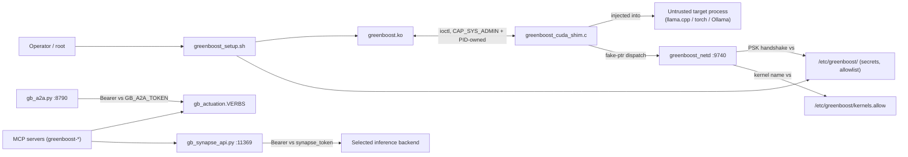

# Trusted computing base for GreenBoost's privileged components

GreenBoost has a **larger** privilege surface than NemoClaw's (kernel
module, an LD_PRELOAD shim injected into other processes, a TCP daemon, an
HTTP gateway) and, until this document, no single place stated what counts
as trusted input to any of them. Section skeleton and the pinned invariant
below are adopted from NemoClaw's own `docs/security/tcb-boundary.mdx`
(NemoClaw audit, Phase 4) — the shape, not the content, since GreenBoost's
components and threat model are different. This is prose written from
scratch against GreenBoost's own source; no NemoClaw code or text is
reproduced here.

## Security Boundary

The operator (root, or a user in the `greenboost` group where noted below),
`greenboost_setup.sh`'s installed artifacts, and root-owned files under
`/etc/greenboost/` are trusted. The CUDA-injected target process's own
environment, any network peer, any file path or PID supplied at runtime,
and any MCP/HTTP caller are untrusted until proven otherwise by the checks
this page names.

Root compromise on the host, or on a connected feeder, is outside this
boundary — either one already controls everything GreenBoost can do on
that machine.

The boundary maintains these invariants:

- **A mutable path, status file, process ID, command line, or listener
  alone never grants authority.** This is the rule item 2 of the NemoClaw
  audit's PID-ownership-proof work (`greenboost_setup.sh`'s
  `_gb_pid_owned`/`_gb_pid_cmdline_matches`/`_gb_stop_pid`) implements, and
  the rule `do_purge`'s pre-audit `pkill -f`/`fuser -k` calls broke: a
  process holding the right name or port is not the same thing as a
  process this operator started.
- Only root can load the kernel module or write `/etc/greenboost/`; every
  privileged `ioctl` additionally checks `capable(CAP_SYS_ADMIN)` or PID
  ownership at the syscall boundary itself, not just at the shim layer
  above it (`greenboost.c`, e.g. the `GB_IOCTL_PIN_USER_PTR`/tier-control
  paths gate on `buf->owner_pid != task_pid_vnr(current) &&
  !capable(CAP_SYS_ADMIN)`).
- A non-loopback network bind requires an explicit credential and refuses
  to start without one — `gb_a2a.py` (`GB_A2A_TOKEN`) and
  `gb_synapse_api.py` (`GB_SYNAPSE_TOKEN`/`/etc/greenboost/synapse_token`)
  both enforce this at `main()`, not as an afterthought header check.
  `greenboost_netd` is the one exception, and it is named as a limit below,
  not a model to copy.
- A kernel-dispatch target for cluster compute must be on an explicit
  allowlist (`/etc/greenboost/kernels.allow`); its absence rejects every
  kernel, it does not silently permit them.
- A failed or ambiguous proof stops the operation — it does not fall back
  to a weaker mode silently. Where GreenBoost's own history shows this
  invariant was violated and later fixed (the CUDA shim's Blackwell VMM
  override, `greenboost_cuda_shim.c`/`greenboost_vmm_override.c`, per
  CLAUDE.md's "T2 Spill Through the Shim, Never CPU Offload" rule), the fix
  is cited here as the standard the newer components below already meet.

> **Review requirement.** A change to any component or invariant on this
> page needs a security-focused review pass and its own regression
> coverage before merge — a green test suite is not a substitute for
> checking privilege, process identity, and fail-closed behavior by hand.

## Component Map

| Component | Execution & privilege | Trusted input | Security responsibility |
|---|---|---|---|
| `greenboost.ko` | Ring 0. Loaded by root (`insmod`/DKMS); the character device it exposes is root-created. | `ioctl` arguments from any process holding an open fd to `/dev/greenboost`; validated against `capable(CAP_SYS_ADMIN)` and, for several ioctls, PID-ownership of the target allocation (`greenboost.c`). | Owns T1↔T2↔T3 tier state, DMA-BUF pinning, the `gaming_mode` LRU-priority flag (deliberately unprivileged — see CLAUDE.md's Gaming Coexistence section — any user may toggle it, but it can only reprioritize eviction order, never bypass the safety reserve or read/write memory it doesn't already own). |
| `greenboost_cuda_shim.c` (LD_PRELOAD) | Runs **inside** an untrusted target process (llama.cpp, torch, Ollama, …) at that process's privilege level, not GreenBoost's own. | The target process's own memory layout, argv, and environment — all untrusted from the shim's perspective, since the shim did not create that process. | Intercepts CUDA driver calls (`cudaMalloc`, `cuLaunchKernel`, …) to redirect allocation and dispatch across T1/T2/T3 and, when connected, feeder memory. Never trusts the hosting process to be well-behaved; every redirect still goes through the kernel module's own ownership/capability checks above. |
| `greenboost_netd` (`:9740`) | Runs as root (fork-safety requires the CUDA warmup happen post-fork, in the daemon child — see CLAUDE.md's fork-safety note); binds `0.0.0.0` by default. | A connecting peer's PSK handshake (HMAC-SHA256 challenge/nonce, `/etc/greenboost/cluster.key`, mode `0600` root-only or `0640` root:greenboost) and, per kernel dispatch, membership in `/etc/greenboost/kernels.allow`. | Serves feeder T1/T2/T3 allocation and data-driven kernel dispatch to authenticated peers only. **This is the one component on this page whose SAFE default is fail-closed but whose ACTUAL default bind is not loopback** — see Topology Limits below; do not model a new network-facing GreenBoost component on netd's bind default, model it on `gb_a2a.py`'s instead. |
| `gb_a2a.py` (`:8790`) | Runs as the installing operator via `greenboost-a2a.service` (systemd); loopback-only unless `GB_A2A_TOKEN` is set. | `Authorization: Bearer <GB_A2A_TOKEN>` (checked with `hmac`-safe string equality) for any non-loopback caller; the verb name against `gb_actuation.VERBS`' allowlist. | JSON-RPC actuation gateway for GreenBoost's own tiering/quant/cluster/serving levers, double-gated (`confirm=True` AND `GB_ORCH_ACTUATE=1`) on top of the bearer check — the reference model for "authenticate before you'll even talk to a non-local caller" (see `docs/a2a-interop.md`). |
| `gb_synapse_api.py` (`:11369`) | Runs as the operator's chosen user, spawned by `gb_synapse.serve()`; loopback-only unless `GB_SYNAPSE_BIND` + a token are both set. | `Authorization: Bearer <token>` (`GB_SYNAPSE_TOKEN` or `/etc/greenboost/synapse_token`, `hmac.compare_digest` on bytes) for any non-loopback bind; refuses to start on a non-loopback bind with no token at all. | OpenAI/Ollama-compatible proxy in front of the selected inference backend. Landed as Track 1 of the NemoClaw audit specifically because it did NOT meet this bar before that work (`0.0.0.0:11435`, unauthenticated) — see `CHANGELOG.md`'s v3.5 entry. |
| `/etc/greenboost/` | Root-owned directory (`chmod 0755`), individual secrets inside it root-only or root:greenboost-group-readable (`cluster.key`, `synapse_token`). | Nothing — this is a trusted STORE, not a component that accepts external input. | Holds cluster identity (`cluster.key`, `cluster.conf`), operator-set tokens, and the kernel-dispatch allowlist. `do_purge`'s preserve-across-reinstall list (`_kf` loop) is the one place that must stay symmetric with whatever gets written here — see the Installer/Uninstaller Parity MUST-RULE. |
| `semantics/*.yaml` | Read by `gb_semantics.py` at query time; not writable by any served request. | The files themselves — human-authored, not runtime input. | Defines the governed metric/segment/route layer (`gb semantics answer`). Fail-loud on malformed YAML by construction (a broken definition file breaks the resolver for that metric, it does not silently return a plausible-looking wrong number) — trusted-but-validated, the same posture NemoClaw's doc gives its own installed helper scripts. |

## Interaction Model

A caller with only network reachability to `:8790` or `:11369` gets nothing
without the matching bearer token; a peer with only network reachability to
`:9740` gets nothing without the matching PSK. The shim never trusts the
process it runs inside — every allocation and kernel-dispatch decision it
makes is re-checked by the kernel module or, for remote dispatch, by
`kernels.allow`.

## Filesystem and Descriptor Proofs

`greenboost_setup.sh`'s `do_purge` preserve mechanism is the filesystem-side
proof this page names most concretely: reinstall paths copy exactly
`cluster.key`, `cluster.conf`, `known_hosts`, `turboquant.enabled`,
`ggml_2dev.enabled`, and `synapse_token` out of `/etc/greenboost/` into a
`mktemp -d` staging directory *before* the wholesale `rm -rf
/etc/greenboost`, then copies them back and re-applies `chmod 0755` on the
directory (not the `mktemp` dir's own `0700`, which would lock out every
non-root reader — the shim, `gb_cluster.py`, the cluster display). A true
uninstall skips this preserve step entirely, so secrets do not outlive the
product.

`greenboost_netd`'s PSK loader (`gb_load_psk`) rejects a key file that
isn't a regular file, that has an insecure mode (anything other than
`0600` root-only or `0640` root:greenboost-group), or that isn't exactly 64
hex characters (32 bytes) — a previous version of this loader would accept
a truncated key file and silently read leading-zero garbage from an
uninitialized buffer as if it were real key material, producing a
low-entropy PSK both daemons would still "agree" on. It also
`explicit_bzero`s the key buffer on every exit path so the secret does not
linger in stack memory past the frame that read it.

## Process and Listener Proofs

The `_gb_pid_owned`/`_gb_pid_cmdline_matches`/`_gb_stop_pid` helpers added
by the NemoClaw audit (Phase 2, `greenboost_setup.sh`) are GreenBoost's
version of this section: ownership is checked *before* cmdline matching
(so a foreign process with a coincidentally matching name is skipped, not
killed), and a stop is only reported once `ps -p` — not `kill -0`, which
conflates "exists but I can't signal it" with "already gone" — confirms
real exit, with SIGKILL as the escalation only after SIGTERM's poll window
expires. Applied to the eBPF tracer, `cmd_feed stop`'s netd kill, and
(inlined, since these run inside a separate SSH heredoc with no access to
the parent script's functions) the feeder-side netd rebuild/upgrade
paths, which instead verify `/proc/<pid>/exe` resolves to the real
installed binary before signalling.

**Correction, same day (live incident):** the `/dev/greenboost` holder
sweep (`_kill_dev_users`) originally also carried this ownership check,
and it was wrong there — removed the same day it landed. Opening
`/dev/greenboost` at all already requires passing the kernel's own DAC/
ACL check (`crw-rw---- root:video` plus per-service ACL grants, e.g.
`ollama.service` running as its own dedicated `User=ollama` account), so
"holds this exact special-purpose device open" is already sufficient
proof — there is no scenario where a truly foreign process ends up
holding it by coincidence. Layering the operator-UID check on top only
rejected legitimate, differently-privileged consumers: confirmed live,
`ollama.service`'s `Restart=always` respawned under the `ollama` user
every retry, the gate refused it every time, and `rmmod` never saw
refcnt reach 0. This is the one kill site on this page where "holds a
mutable path/PID open" genuinely IS enough on its own — the general
invariant above still holds for every other kill site named here, where
the match is by name or PID-file contents instead of a kernel-enforced
device permission.

`greenboost_netd`'s PSK handshake is itself a process/listener proof in the
network sense: a connection is accepted at the TCP layer regardless of
peer identity (netd binds `0.0.0.0`), but no `GB_MSG_CUDA_MALLOC`/
`GB_MSG_CUDA_EXEC` request is honored until that connection completes the
nonce/HMAC exchange — `SO_RCVTIMEO`/`SO_SNDTIMEO` set to 2 seconds on the
handshake socket specifically so an attacker who opens a connection and
never sends bytes cannot pin the single-threaded epoll loop indefinitely
(a real pre-auth DoS the current timeout exists to close).

## Topology Limits

**`greenboost_netd` binds `0.0.0.0` by default, not loopback.** This is the
one place on this page where the safe-by-construction pattern the other
network-facing components use (`gb_a2a.py`, `gb_synapse_api.py`: loopback
default, refuse a wider bind without a token) is NOT how the existing
component behaves — netd's safety instead comes entirely from the PSK
handshake described above. Two consequences follow directly:

- **`cluster.key` absence is fail-CLOSED as of the PR-C/C7 fix** — every
  connection is rejected until a key exists — but an operator can opt back
  into the OLD fail-OPEN behavior with `GREENBOOST_ALLOW_UNAUTH=1`,
  documented in-source as intended for local-loopback bring-up only. This
  is a real, present escape hatch, not a hypothetical one: never set it on
  a box with a non-loopback-reachable network interface.
- The kernel-dispatch allowlist (`kernels.allow`) is the second,
  independent gate a connection must clear even after PSK auth succeeds —
  remote GPU **compute** dispatch (not just memory) requires the target
  kernel's name to appear in that file. Its absence rejects every kernel
  outright; it does not fall back to "allow anything the PSK already
  authenticated."

**The CUDA shim runs inside a process GreenBoost does not fully control.**
Any hook it installs is only as trustworthy as the assumption that the
hosting process's own memory isn't already compromised by something else
running in that same address space — this is a structural limit of
LD_PRELOAD-based interception, not a bug to fix. The shim's job is to
never make that limit WORSE (e.g., never trust a value the hosting process
supplied without the kernel module's own ownership/capability check
re-validating it), not to eliminate the limit itself.

**Kernel-module ioctl trust is per-call, not per-fd.** Opening
`/dev/greenboost` grants no blanket authority; each privileged ioctl
re-checks `capable(CAP_SYS_ADMIN)` or PID-ownership of the specific
allocation being touched. This means a compromised unprivileged process
holding the fd still cannot escalate through it — the fd is necessary but
never sufficient.

## Review and Removal Conditions

Reviewers must re-check this page when: a new component listens on a
network port, ANY existing component's default bind or auth model changes,
`do_purge`'s preserve list changes without a matching audit (see the
Installer/Uninstaller Parity MUST-RULE), or a new privileged `ioctl` is
added to `greenboost.c` without an accompanying `capable()`/ownership
check.

- **`GREENBOOST_ALLOW_UNAUTH=1`** (netd's fail-open opt-out) should be
  removed, or at minimum gated to refuse a non-loopback bind the same way
  `gb_a2a.py`/`gb_synapse_api.py` already do, once a real use case forces
  the question — today it exists for legacy local bring-up and nothing
  currently depends on it in a way that would break by tightening it.
- **`greenboost_netd`'s `0.0.0.0` default bind** is the one item on this
  page most worth revisiting: nothing observed during this audit REQUIRES
  the default to be non-loopback (a feeder is explicitly configured via
  `greenboost connect <IP>` from the host side, which already knows the
  feeder's address), so defaulting netd to loopback-plus-explicit-bind
  (mirroring `gb_a2a.py`'s shape) would close the one topology gap this
  page had to call out as an exception rather than removing it outright.
  Not changed in this pass — flagged for a follow-up session, since it is
  a behavior change for every existing feeder deployment, not documentation
  alone.
- Keep the kernel module's per-ioctl `capable(CAP_SYS_ADMIN)`/PID-ownership
  checks as the enforcement point of record; a future Python- or shim-level
  check is defense in depth, never a substitute for the kernel-side gate.
